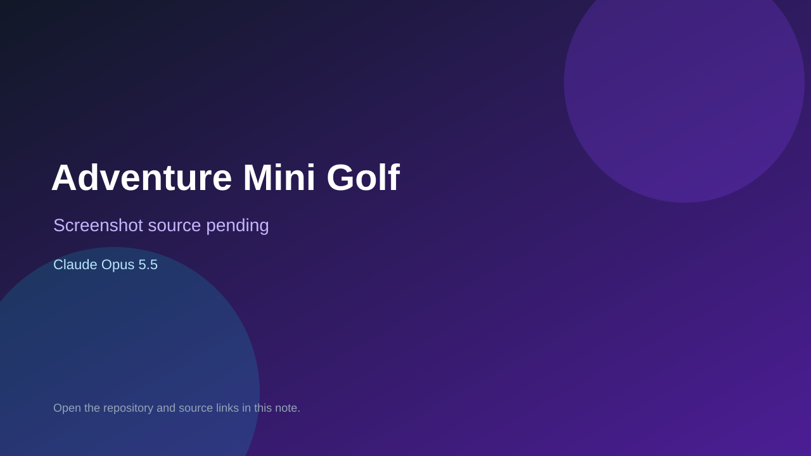

# Adventure Mini Golf

> Verified game note.

## At a glance

- **Score:** 8.4/10
- **Model:** Claude Opus 5.5
- **Technology:** Three.js, JavaScript, Vite, Web Audio
- **Estimated FP32 operations/s at 60 FPS:** 120,000,000 (low confidence; static estimate, not measured).
- **Rating basis:** Estimate source completeness, mechanics, documented run path, tests and attribution; do not treat this as a visual review or runtime benchmark.
- **Verified:** 2026-09-30
- **Repository:** [https://github.com/leonvanzyl/3d-golf-opus](https://github.com/leonvanzyl/3d-golf-opus)
- **Evidence:** [direct model evidence](https://github.com/leonvanzyl/3d-golf-opus/commit/cf93bc94459a459a0aff61667a38d1e60a2154d5)
- **Live demo:** [open demo](https://3d-golf-opus.vercel.app/)

## Screenshots

No screenshot source is recorded yet. Keep the placeholder until a repository, awesome list, or creator source provides an image.

## Model attribution

Open the evidence link above. Evidence grade: **direct model evidence**.

## Source description

Inspect a distinct golf implementation with course loading, putt input, hazards, hole completion, scorecards and local best rounds; count its nine holes as one game. Inspect the checked-in entry point and gameplay systems. Treat repository creation as a freshness proxy, not proof of game creation or publication. Do not treat this source verification as a runtime playtest.

### Gameplay source

- [https://github.com/leonvanzyl/3d-golf-opus/blob/cf93bc94459a459a0aff61667a38d1e60a2154d5/src/main.js](https://github.com/leonvanzyl/3d-golf-opus/blob/cf93bc94459a459a0aff61667a38d1e60a2154d5/src/main.js)
- [https://github.com/leonvanzyl/3d-golf-opus/commit/cf93bc94459a459a0aff61667a38d1e60a2154d5](https://github.com/leonvanzyl/3d-golf-opus/commit/cf93bc94459a459a0aff61667a38d1e60a2154d5)

## Verification notes

- **Status:** verified_source
- **Counted units in repository:** 1
- **Units covered by this note:** 1
- **Discovery:** GitHub model-and-date repository search; commit-attribution freshness join (September 29–30 UTC+7); https://github.com/leonvanzyl/3d-golf-opus

[Back to the awesome list](../../README.md)
