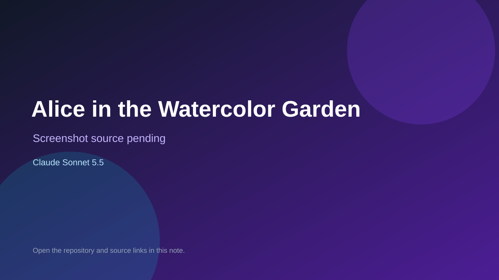

# Alice in the Watercolor Garden

> Verified game note.

## At a glance

- **Score:** 7.8/10
- **Model:** Claude Sonnet 5.5
- **Technology:** Three.js, JavaScript, Web Audio
- **Estimated FP32 operations/s at 60 FPS:** 120,000,000 (low confidence; static estimate, not measured).
- **Rating basis:** Estimate source completeness, mechanics, documented run path, tests and attribution; do not treat this as a visual review or runtime benchmark.
- **Verified:** 2026-09-30
- **Repository:** [https://github.com/hatakoma/cc_alice](https://github.com/hatakoma/cc_alice)
- **Evidence:** [direct model evidence](https://github.com/hatakoma/cc_alice/commit/98f3fd73df0ac04fff9e08a63a7781b15f084604)
- **Live demo:** [open demo](https://hatakoma.github.io/cc_alice/)

## Screenshots

No screenshot source is recorded yet. Keep the placeholder until a repository, awesome list, or creator source provides an image.

## Model attribution

Open the evidence link above. Evidence grade: **direct model evidence**.

## Source description

Inspect third-person movement, jumping, paint shots that defeat card soldiers, bottle collection and completion after three DRINK ME bottles. Inspect the checked-in entry point and gameplay systems. Treat repository creation as a freshness proxy, not proof of game creation or publication. Do not treat this source verification as a runtime playtest.

### Gameplay source

- [https://github.com/hatakoma/cc_alice/blob/a558d9c40df8d950e48215dfe01afdbf7a1ef5f1/index.html](https://github.com/hatakoma/cc_alice/blob/a558d9c40df8d950e48215dfe01afdbf7a1ef5f1/index.html)
- [https://github.com/hatakoma/cc_alice/commit/98f3fd73df0ac04fff9e08a63a7781b15f084604](https://github.com/hatakoma/cc_alice/commit/98f3fd73df0ac04fff9e08a63a7781b15f084604)

## Verification notes

- **Status:** verified_source
- **Counted units in repository:** 1
- **Units covered by this note:** 1
- **Discovery:** GitHub model-and-date repository search; commit-attribution freshness join (September 29–30 UTC+7); https://github.com/hatakoma/cc_alice

[Back to the awesome list](../../README.md)
