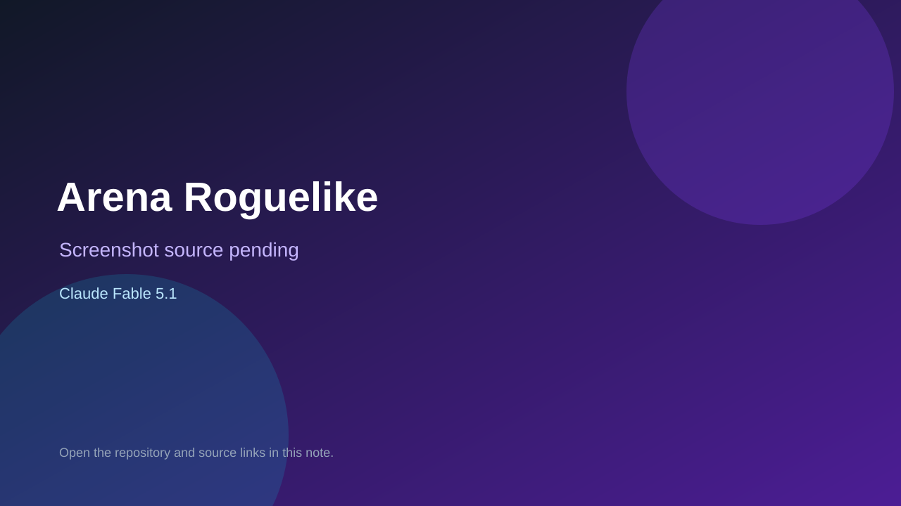

# Arena Roguelike

> Top-list entry: **today** (#9).

## At a glance

- **Score:** 8.0/10
- **Model:** Claude Fable 5.1
- **Technology:** Godot 4, GDScript, Native desktop
- **Estimated FP32 operations/s at 60 FPS:** 1,000,000,000 (low confidence; static estimate, not measured).
- **Rating basis:** Conservative source-scope estimate from documented mechanics and code; not a visual rating or runtime playtest.
- **Verified:** 2026-09-28
- **Repository:** [https://github.com/beben-games/2d-game](https://github.com/beben-games/2d-game)
- **Evidence:** [direct model evidence](https://github.com/beben-games/2d-game/commit/398d7a117290f7bbebdd7608a1acda8198676427)

## Screenshots

No screenshot source is recorded yet. Keep the placeholder until a repository, awesome list, or creator source provides an image.

## Model attribution

Open the evidence link above. Evidence grade: **direct model evidence**.

## Source description

Fight through eight rooms with attacks and dashes, choose upgrade cards and weapon effects, and defeat the final boss. Source and primary model evidence reviewed; no interactive runtime playtest performed. Repository creation is not proof of game publication.

### Gameplay source

- [https://github.com/beben-games/2d-game/blob/573f870fc440244f0a68be8cbebc119f2b528025/project.godot](https://github.com/beben-games/2d-game/blob/573f870fc440244f0a68be8cbebc119f2b528025/project.godot)
- [https://github.com/beben-games/2d-game/commit/398d7a117290f7bbebdd7608a1acda8198676427](https://github.com/beben-games/2d-game/commit/398d7a117290f7bbebdd7608a1acda8198676427)

## Verification notes

- **Status:** verified_source
- **Counted units in repository:** 1
- **Units covered by this note:** 1
- **Discovery:** GitHub model/game source search; creation filtered to 2026-09-21..2026-09-28 Asia/Ho_Chi_Minh; https://github.com/beben-games/2d-game

[Back to the awesome list](../../README.md)
