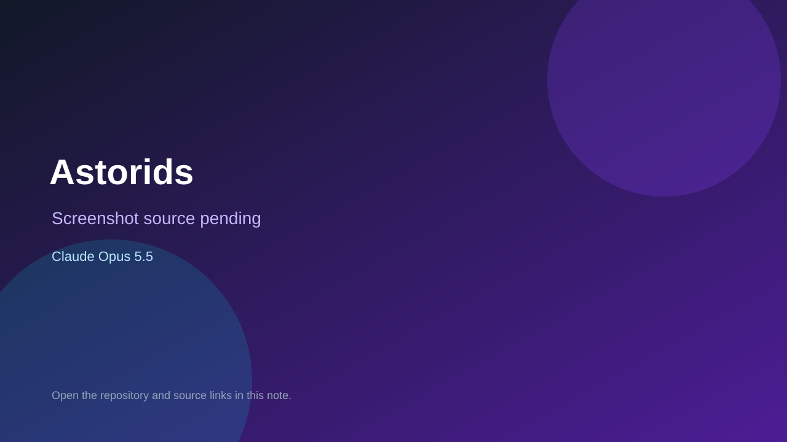

# Astorids

> Top-list entry: **this month** (#17).

## At a glance

- **Score:** 7.9/10
- **Model:** Claude Opus 5.5
- **Technology:** Python, JavaScript, Browser
- **Estimated FP32 operations/s at 60 FPS:** 300,000,000 (low confidence; static estimate, not measured).
- **Rating basis:** Playable browser game plus training gym; no playtest.
- **Verified:** 2026-10-07
- **Repository:** [https://github.com/Crunchy000/astorids](https://github.com/Crunchy000/astorids)
- **Evidence:** [direct model evidence](https://github.com/Crunchy000/astorids/commit/89ffe0086c0bc9e945b674b07c0e143771fe59a8)

## Screenshots

No screenshot source is recorded yet. Keep the placeholder until a repository, awesome list, or creator source provides an image.

## Model attribution

Open the evidence link above. Evidence grade: **direct model evidence**.

## Source description

Asteroids style browser game plus a training gym with bots, league Elo and a PPO agent that beats the bot; Opus 5.5 trailers.

### Gameplay source

- [https://github.com/Crunchy000/astorids/blob/ccr-ccbf1ca0-erm5dw/index.html](https://github.com/Crunchy000/astorids/blob/ccr-ccbf1ca0-erm5dw/index.html)
- [https://github.com/Crunchy000/astorids/commit/89ffe0086c0bc9e945b674b07c0e143771fe59a8](https://github.com/Crunchy000/astorids/commit/89ffe0086c0bc9e945b674b07c0e143771fe59a8)

## Verification notes

- **Status:** verified_source
- **Counted units in repository:** 1
- **Units covered by this note:** 1
- **Discovery:** GitHub commit pool: Opus/Sonnet game commits filtered to repos created Oct 6-7 (Asia/Ho_Chi_Minh); https://github.com/Crunchy000/astorids; https://github.com/Crunchy000/astorids/commit/89ffe0086c0bc9e945b674b07c0e143771fe59a8

[Back to the awesome list](../../README.md)
