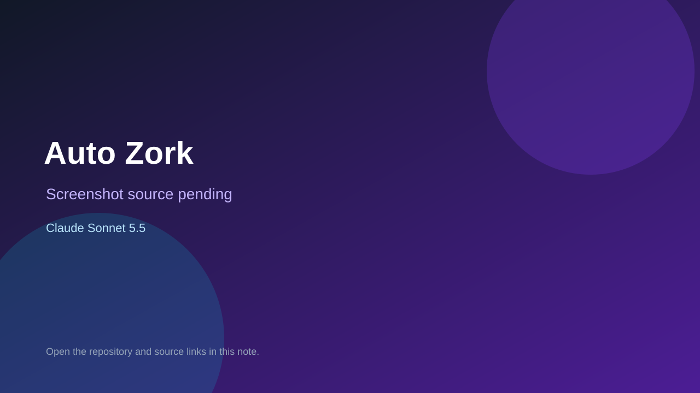

# Auto Zork

> Top-list entry: **today** (#1), **this month** (#1).

## At a glance

- **Score:** 8.1/10
- **Model:** Claude Sonnet 5.5
- **Technology:** Python, Flask, HTML, JavaScript, MCP, Browser dashboard
- **Estimated FP32 operations/s at 60 FPS:** 180,000,000 (low confidence; static estimate, not measured).
- **Rating basis:** Strong source-backed, self-contained adventure structure with dozens of rooms and items, puzzle/combat state, saves, direct manual play and an automated perfect-run path. No independent browser playtest performed.
- **Verified:** 2026-10-02
- **Repository:** [https://github.com/petershk/auto-zork](https://github.com/petershk/auto-zork)
- **Evidence:** [direct model evidence](https://github.com/petershk/auto-zork/commit/9fcff8f705b9c98589766e9bbac9532c037309a4)

## Screenshots

No screenshot source is recorded yet. Keep the placeholder until a repository, awesome list, or creator source provides an image.

## Model attribution

Open the evidence link above. Evidence grade: **direct model evidence**.

## Source description

The README and source describe a playable Zork I text adventure with 110 rooms, 85 items, classic puzzles, combat, a roaming thief, a 350-point objective, a browser dashboard, manual play, saves and a scripted perfect-run/autoplay check. The initial-release commit has an exact Co-Authored-By: Claude Sonnet 5.5 trailer. Count the game once; do not count its MCP server as a separate game. Repository creation date is a freshness proxy, not an explicit game-publication date. No public hosted demo was identified.

### Gameplay source

- [https://github.com/petershk/auto-zork/blob/9fcff8f705b9c98589766e9bbac9532c037309a4/README.md](https://github.com/petershk/auto-zork/blob/9fcff8f705b9c98589766e9bbac9532c037309a4/README.md)
- [https://github.com/petershk/auto-zork/commit/9fcff8f705b9c98589766e9bbac9532c037309a4](https://github.com/petershk/auto-zork/commit/9fcff8f705b9c98589766e9bbac9532c037309a4)

## Verification notes

- **Status:** verified_source
- **Counted units in repository:** 1
- **Units covered by this note:** 1
- **Discovery:** GitHub commit search: "Claude Sonnet 5.5" game committer-date:2026-09-29..2026-10-02; https://github.com/petershk/auto-zork

[Back to the awesome list](../../README.md)
