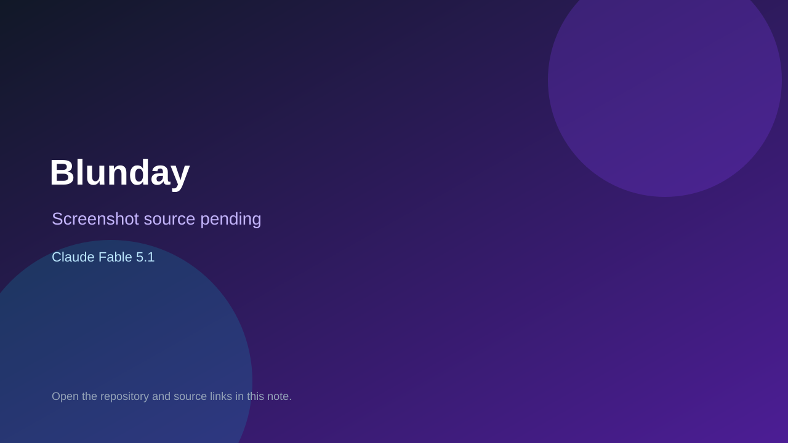

# Blunday

> Verified game note.

## At a glance

- **Score:** 7.8/10
- **Model:** Claude Fable 5.1
- **Technology:** React, Vite, JavaScript, Canvas 2D, Browser
- **Estimated FP32 operations/s at 60 FPS:** 100,000,000 (low confidence; static estimate, not measured).
- **Rating basis:** Conservative source-scope estimate from documented mechanics and code; not a visual rating or runtime playtest.
- **Verified:** 2026-09-28
- **Repository:** [https://github.com/EZpixel/Blunday](https://github.com/EZpixel/Blunday)
- **Evidence:** [creator-reported model evidence](https://github.com/EZpixel/Blunday/blob/d42f521bf4d527edbdbe36edea328f162ff5bbd9/README.md)

## Screenshots

No screenshot source is recorded yet. Keep the placeholder until a repository, awesome list, or creator source provides an image.

## Model attribution

Open the evidence link above. Evidence grade: **creator-reported model evidence**.

## Source description

Jump and dodge through platform stages, collect gold, buy upgrades and try to reach the Moon; falling ends the run. Source and primary model evidence reviewed; no interactive runtime playtest performed. Repository creation is not proof of game publication.

### Gameplay source

- [https://github.com/EZpixel/Blunday/blob/d42f521bf4d527edbdbe36edea328f162ff5bbd9/src/components/GameCanvas.jsx](https://github.com/EZpixel/Blunday/blob/d42f521bf4d527edbdbe36edea328f162ff5bbd9/src/components/GameCanvas.jsx)
- [https://github.com/EZpixel/Blunday/blob/d42f521bf4d527edbdbe36edea328f162ff5bbd9/README.md](https://github.com/EZpixel/Blunday/blob/d42f521bf4d527edbdbe36edea328f162ff5bbd9/README.md)

## Verification notes

- **Status:** verified_source
- **Counted units in repository:** 1
- **Units covered by this note:** 1
- **Discovery:** GitHub model/game source search; creation filtered to 2026-09-21..2026-09-28 Asia/Ho_Chi_Minh; https://github.com/EZpixel/Blunday

[Back to the awesome list](../../README.md)
