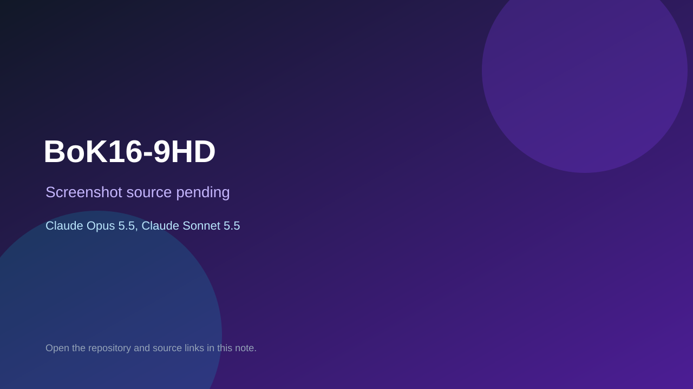

# BoK16-9HD

> Top-list entry: **today** (#9), **this week** (#12), **this month** (#12).

## At a glance

- **Score:** 8.0/10
- **Model:** Claude Opus 5.5, Claude Sonnet 5.5
- **Technology:** TypeScript, Browser, WebGL
- **Estimated FP32 operations/s at 60 FPS:** 1,200,000,000 (low confidence; static estimate, not measured).
- **Rating basis:** Large explorable 3D world with quests and encounters; no playtest.
- **Verified:** 2026-10-07
- **Repository:** [https://github.com/rhamillnz/BoK16-9HD](https://github.com/rhamillnz/BoK16-9HD)
- **Evidence:** [direct model evidence](https://github.com/rhamillnz/BoK16-9HD/commit/1f8f3a8245b0b53482b509d7e1d6d622f142e4f1)

## Screenshots

No screenshot source is recorded yet. Keep the placeholder until a repository, awesome list, or creator source provides an image.

## Model attribution

Open the evidence link above. Evidence grade: **direct model evidence**.

## Source description

3D medieval world with dialogue, teleports, zone transitions and an encounter runner; Opus 5.5 world building with Sonnet 5.5 systems commits.

### Gameplay source

- [https://github.com/rhamillnz/BoK16-9HD/blob/main/index.html](https://github.com/rhamillnz/BoK16-9HD/blob/main/index.html)
- [https://github.com/rhamillnz/BoK16-9HD/commit/1f8f3a8245b0b53482b509d7e1d6d622f142e4f1](https://github.com/rhamillnz/BoK16-9HD/commit/1f8f3a8245b0b53482b509d7e1d6d622f142e4f1)

## Verification notes

- **Status:** verified_source
- **Counted units in repository:** 1
- **Units covered by this note:** 1
- **Discovery:** GitHub commit pool: Opus/Sonnet game commits filtered to repos created Oct 6-7 (Asia/Ho_Chi_Minh); https://github.com/rhamillnz/BoK16-9HD; https://github.com/rhamillnz/BoK16-9HD/commit/1f8f3a8245b0b53482b509d7e1d6d622f142e4f1

[Back to the awesome list](../../README.md)
