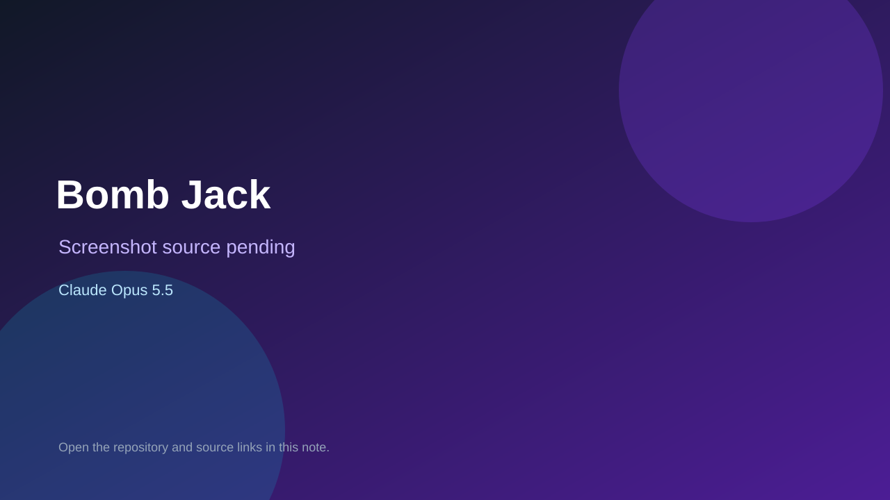

# Bomb Jack

> Top-list entry: **today** (#5), **this week** (#7), **this month** (#7).

## At a glance

- **Score:** 8.2/10
- **Model:** Claude Opus 5.5
- **Technology:** Go, Ebitengine, Browser
- **Estimated FP32 operations/s at 60 FPS:** 400,000,000 (low confidence; static estimate, not measured).
- **Rating basis:** Complete platformer loop with levels, music, scoring and a browser build, all under exact Opus trailers; no independent playtest.
- **Verified:** 2026-10-07
- **Repository:** [https://github.com/teedjay/go-bombjack](https://github.com/teedjay/go-bombjack)
- **Evidence:** [direct model evidence](https://github.com/teedjay/go-bombjack/commit/e76b535f50116e07eb35385b8ea0271638dcaad0)

## Screenshots

No screenshot source is recorded yet. Keep the placeholder until a repository, awesome list, or creator source provides an image.

## Model attribution

Open the evidence link above. Evidence grade: **direct model evidence**.

## Source description

Bomb Jack style platformer in Go and Ebitengine with levels, SID style music, high scores and a browser build; every inspected game commit co-authors Claude Opus 5.5.

### Gameplay source

- [https://github.com/teedjay/go-bombjack/blob/main/cmd/bombjack/main.go](https://github.com/teedjay/go-bombjack/blob/main/cmd/bombjack/main.go)
- [https://github.com/teedjay/go-bombjack/commit/e76b535f50116e07eb35385b8ea0271638dcaad0](https://github.com/teedjay/go-bombjack/commit/e76b535f50116e07eb35385b8ea0271638dcaad0)

## Verification notes

- **Status:** verified_source
- **Counted units in repository:** 1
- **Units covered by this note:** 1
- **Discovery:** GitHub repository search: Claude Opus 5.5 created 2026-10-06..2026-10-07; https://github.com/teedjay/go-bombjack; https://github.com/teedjay/go-bombjack/commit/e76b535f50116e07eb35385b8ea0271638dcaad0

[Back to the awesome list](../../README.md)
