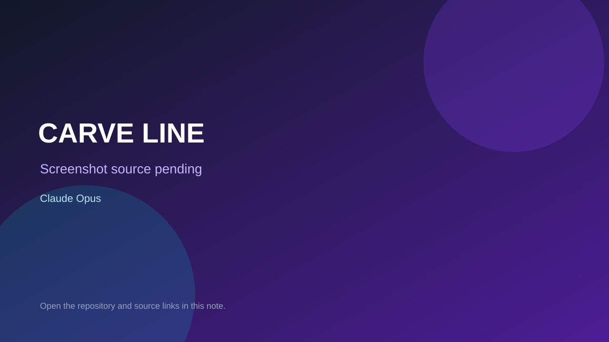

# CARVE LINE

> Top-list entry: **today** (#1).

## At a glance

- **Score:** 8.0/10
- **Model:** Claude Opus
- **Technology:** Three.js, JavaScript, WebGL, Browser
- **Estimated FP32 operations/s at 60 FPS:** 1,000,000,000 (low confidence; static estimate, not measured).
- **Rating basis:** Conservative source-scope estimate from implemented controls, rules and state; not a visual rating or runtime playtest.
- **Verified:** 2026-09-27
- **Repository:** [https://github.com/TetrisSQC/carveline](https://github.com/TetrisSQC/carveline)
- **Evidence:** [creator-reported model evidence](https://github.com/TetrisSQC/carveline/blob/efe3bf22020986de38ad29e987a3b065e331d77e/README.md)

## Screenshots

No screenshot source is recorded yet. Keep the placeholder until a repository, awesome list, or creator source provides an image.

## Model attribution

Open the evidence link above. Evidence grade: **creator-reported model evidence**.

## Source description

Snowboard downhill, carve, jump and perform tricks; race AI rivals through slalom gates, pursue score and best times, and save a ghost. README attributes development to Claude Opus without specifying a version. Verify source only; do not infer runtime success or publication date from repository creation.

### Gameplay source

- [https://github.com/TetrisSQC/carveline/blob/efe3bf22020986de38ad29e987a3b065e331d77e/index.html](https://github.com/TetrisSQC/carveline/blob/efe3bf22020986de38ad29e987a3b065e331d77e/index.html)
- [https://github.com/TetrisSQC/carveline/blob/efe3bf22020986de38ad29e987a3b065e331d77e/README.md](https://github.com/TetrisSQC/carveline/blob/efe3bf22020986de38ad29e987a3b065e331d77e/README.md)

## Verification notes

- **Status:** verified_source
- **Counted units in repository:** 1
- **Units covered by this note:** 1
- **Discovery:** GitHub repository search: model/game created:2026-09-25..2026-09-27; exact creation timestamp filtered to Asia/Ho_Chi_Minh September 26–27; https://github.com/TetrisSQC/carveline

[Back to the awesome list](../../README.md)
