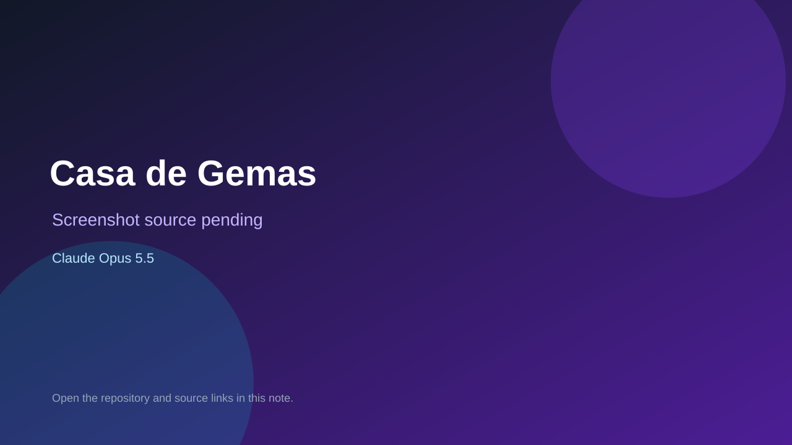

# Casa de Gemas

> Verified game note.

## At a glance

- **Score:** 7.5/10
- **Model:** Claude Opus 5.5
- **Technology:** HTML, JavaScript, Canvas 2D, Web Audio, Browser
- **Estimated FP32 operations/s at 60 FPS:** 100,000,000 (low confidence; static estimate, not measured).
- **Rating basis:** Conservative source-scope estimate from documented mechanics and code; not a visual rating or runtime playtest.
- **Verified:** 2026-09-28
- **Repository:** [https://github.com/deepujain/casadegema](https://github.com/deepujain/casadegema)
- **Evidence:** [creator-reported model evidence](https://github.com/deepujain/casadegema/blob/30cec53ef2cc8a71be9e6fada66242f0b2887746/README.md)
- **Live demo:** [open demo](https://deepujain.github.io/casadegema/)

## Screenshots

No screenshot source is recorded yet. Keep the placeholder until a repository, awesome list, or creator source provides an image.

## Model attribution

Open the evidence link above. Evidence grade: **creator-reported model evidence**.

## Source description

Interact with a seasonal garden, water and shake objects to find five gems per season and reach the final state. Source and primary model evidence reviewed; no interactive runtime playtest performed. Repository creation is not proof of game publication. Interactive browser smoke test: a click on the blue heart/gem produced Oli owl dialogue; the spring-gems counter remained 0/5. This confirms UI interaction, not a completed level.

### Gameplay source

- [https://github.com/deepujain/casadegema/blob/30cec53ef2cc8a71be9e6fada66242f0b2887746/index.html](https://github.com/deepujain/casadegema/blob/30cec53ef2cc8a71be9e6fada66242f0b2887746/index.html)
- [https://github.com/deepujain/casadegema/blob/30cec53ef2cc8a71be9e6fada66242f0b2887746/README.md](https://github.com/deepujain/casadegema/blob/30cec53ef2cc8a71be9e6fada66242f0b2887746/README.md)

## Verification notes

- **Status:** verified_source
- **Counted units in repository:** 1
- **Units covered by this note:** 1
- **Discovery:** GitHub model/game source search; creation filtered to 2026-09-21..2026-09-28 Asia/Ho_Chi_Minh; https://github.com/deepujain/casadegema

[Back to the awesome list](../../README.md)
