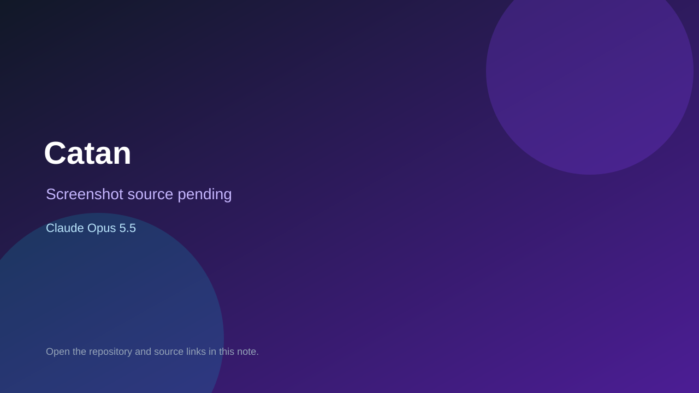

# Catan

> Top-list entry: **today** (#4), **this week** (#5), **this month** (#5).

## At a glance

- **Score:** 8.3/10
- **Model:** Claude Opus 5.5
- **Technology:** JavaScript, Browser
- **Estimated FP32 operations/s at 60 FPS:** 600,000,000 (low confidence; static estimate, not measured).
- **Rating basis:** Complete Catan rules with bots and multiplayer; no live game test.
- **Verified:** 2026-10-07
- **Repository:** [https://github.com/joelraj18/catan](https://github.com/joelraj18/catan)
- **Evidence:** [direct model evidence](https://github.com/joelraj18/catan/commit/56df81e3ed6711a0c25058f7f4bdffa08f5b1d1d)

## Screenshots

No screenshot source is recorded yet. Keep the placeholder until a repository, awesome list, or creator source provides an image.

## Model attribution

Open the evidence link above. Evidence grade: **direct model evidence**.

## Source description

Colonist style Catan with smart bots, 2 to 6 players, trading, dice and voice chat; Opus 5.5 trailers with session links.

### Gameplay source

- [https://github.com/joelraj18/catan/blob/main/public/index.html](https://github.com/joelraj18/catan/blob/main/public/index.html)
- [https://github.com/joelraj18/catan/commit/56df81e3ed6711a0c25058f7f4bdffa08f5b1d1d](https://github.com/joelraj18/catan/commit/56df81e3ed6711a0c25058f7f4bdffa08f5b1d1d)

## Verification notes

- **Status:** verified_source
- **Counted units in repository:** 1
- **Units covered by this note:** 1
- **Discovery:** GitHub commit pool: Opus/Sonnet game commits filtered to repos created Oct 6-7 (Asia/Ho_Chi_Minh); https://github.com/joelraj18/catan; https://github.com/joelraj18/catan/commit/56df81e3ed6711a0c25058f7f4bdffa08f5b1d1d

[Back to the awesome list](../../README.md)
