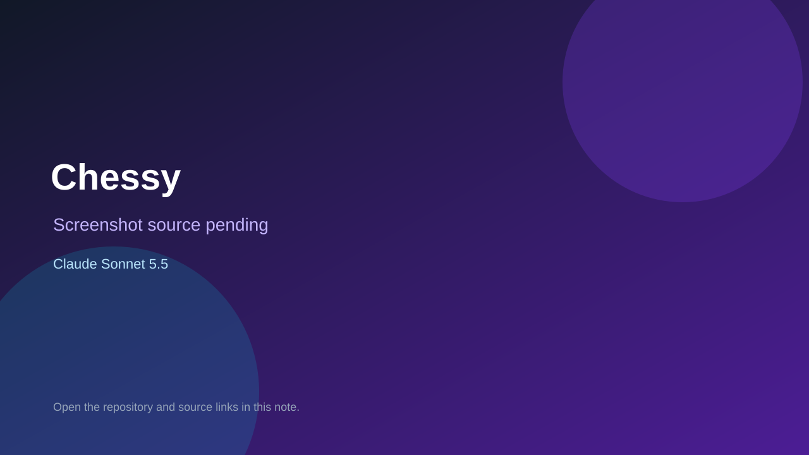

# Chessy

> Top-list entry: **today** (#10), **this week** (#13), **this month** (#13).

## At a glance

- **Score:** 8.0/10
- **Model:** Claude Sonnet 5.5
- **Technology:** TypeScript, Rust, Chess, Browser
- **Estimated FP32 operations/s at 60 FPS:** 400,000,000 (low confidence; static estimate, not measured).
- **Rating basis:** Deep variant systems with rated play; no playtest.
- **Verified:** 2026-10-07
- **Repository:** [https://github.com/garder500/chessy](https://github.com/garder500/chessy)
- **Evidence:** [direct model evidence](https://github.com/garder500/chessy/commit/2076304f3a837a78985822c22b74c55c2083b48c)

## Screenshots

No screenshot source is recorded yet. Keep the placeholder until a repository, awesome list, or creator source provides an image.

## Model attribution

Open the evidence link above. Evidence grade: **direct model evidence**.

## Source description

Chess variant with skills, decks, rated games, replays and sounds; Sonnet 5.5 trailers.

### Gameplay source

- [https://github.com/garder500/chessy/blob/main/web/index.html](https://github.com/garder500/chessy/blob/main/web/index.html)
- [https://github.com/garder500/chessy/commit/2076304f3a837a78985822c22b74c55c2083b48c](https://github.com/garder500/chessy/commit/2076304f3a837a78985822c22b74c55c2083b48c)

## Verification notes

- **Status:** verified_source
- **Counted units in repository:** 1
- **Units covered by this note:** 1
- **Discovery:** GitHub commit pool: Opus/Sonnet game commits filtered to repos created Oct 6-7 (Asia/Ho_Chi_Minh); https://github.com/garder500/chessy; https://github.com/garder500/chessy/commit/2076304f3a837a78985822c22b74c55c2083b48c

[Back to the awesome list](../../README.md)
