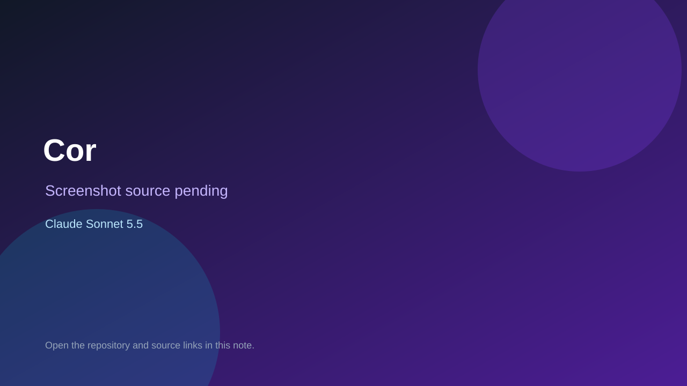

# Cor

> Top-list entry: **this month** (#20).

## At a glance

- **Score:** 7.8/10
- **Model:** Claude Sonnet 5.5
- **Technology:** TypeScript, React, Browser
- **Estimated FP32 operations/s at 60 FPS:** 200,000,000 (low confidence; static estimate, not measured).
- **Rating basis:** Two complete game clients with server logic; no live match test.
- **Verified:** 2026-10-07
- **Repository:** [https://github.com/olucasfl/nocap-app](https://github.com/olucasfl/nocap-app)
- **Evidence:** [direct model evidence](https://github.com/olucasfl/nocap-app/commit/d5deb45935b7307875dd7cc821fb2e9b19646562)

## Screenshots

No screenshot source is recorded yet. Keep the placeholder until a repository, awesome list, or creator source provides an image.

## Model attribution

Open the evidence link above. Evidence grade: **direct model evidence**.

## Source description

Two multiplayer party games with rooms, rankings and tests; Sonnet 5.5 trailers.

### Gameplay source

- [https://github.com/olucasfl/nocap-app/blob/main/apps/web/src/games/color/ColorGame.tsx](https://github.com/olucasfl/nocap-app/blob/main/apps/web/src/games/color/ColorGame.tsx)
- [https://github.com/olucasfl/nocap-app/commit/d5deb45935b7307875dd7cc821fb2e9b19646562](https://github.com/olucasfl/nocap-app/commit/d5deb45935b7307875dd7cc821fb2e9b19646562)

## Verification notes

- **Status:** verified_source
- **Counted units in repository:** 2
- **Units covered by this note:** 1
- **Discovery:** GitHub commit frontier: Sonnet/GPT-6.1 game commits joined to Oct 6-7 creations (Asia/Ho_Chi_Minh); https://github.com/olucasfl/nocap-app; https://github.com/olucasfl/nocap-app/commit/d5deb45935b7307875dd7cc821fb2e9b19646562

[Back to the awesome list](../../README.md)
