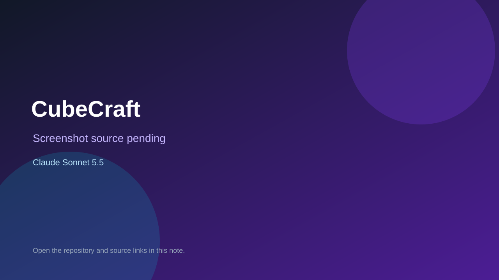

# CubeCraft

> Verified game note.

## At a glance

- **Score:** 7.6/10
- **Model:** Claude Sonnet 5.5
- **Technology:** HTML, CSS, JavaScript, Canvas 2D, Three.js, Browser
- **Estimated FP32 operations/s at 60 FPS:** 1,200,000,000 (low confidence; static estimate, not measured).
- **Rating basis:** Static source audit confirms a distinct playable loop with input, state changes, and a score, win, or progression signal in each counted file. Do not interpret this as a visual assessment or 25-game playtest.
- **Verified:** 2026-10-04
- **Repository:** [https://github.com/kokellara12-maker/apps-k4m9q2](https://github.com/kokellara12-maker/apps-k4m9q2)
- **Evidence:** [direct model evidence](https://github.com/kokellara12-maker/apps-k4m9q2/blob/main/apps.json)
- **Live demo:** [open demo](https://kokellara12-maker.github.io/apps-k4m9q2/cubecraft.html)

## Screenshots

No screenshot source is recorded yet. Keep the placeholder until a repository, awesome list, or creator source provides an image.

## Model attribution

Open the evidence link above. Evidence grade: **direct model evidence**.

## Source description

Count 25 separately named game pages listed in the repository apps.json. Source-inspect each checked-in page for independent input, state/progression and outcome indicators; all 25 were added or expanded by commits with an exact Co-Authored-By: Claude Sonnet 5.5 trailer. Exclude Laboratorio de Pruebas as an open-ended physics sandbox without an objective, and Benalmádena Sim because its game-addition commit is after the research cutoff. Repository creation and individual game commits fall within October 3–4, 2026 in Asia/Ho_Chi_Minh. The hub and sample routes returned HTTP 200; no full 25-game playthrough was performed.

### Gameplay source

- [https://github.com/kokellara12-maker/apps-k4m9q2/blob/main/cubecraft.html](https://github.com/kokellara12-maker/apps-k4m9q2/blob/main/cubecraft.html)
- [https://github.com/kokellara12-maker/apps-k4m9q2/blob/main/apps.json](https://github.com/kokellara12-maker/apps-k4m9q2/blob/main/apps.json)

## Verification notes

- **Status:** verified_source
- **Counted units in repository:** 25
- **Units covered by this note:** 1
- **Discovery:** GitHub repository and commit search: Claude Sonnet 5.5 game commits and repositories created 2026-10-03–2026-10-04 (Asia/Ho_Chi_Minh; cutoff 2026-10-04T13:24:53Z); https://github.com/kokellara12-maker/apps-k4m9q2; https://github.com/kokellara12-maker/apps-k4m9q2/blob/main/apps.json; https://github.com/kokellara12-maker/apps-k4m9q2/commit/957d79dce132b2d74178e1e430abdc8fb248cb12; https://github.com/kokellara12-maker/apps-k4m9q2/commit/acc14cb4d3cdb6ea9ee81e29ef7aa82c37a70263; https://github.com/kokellara12-maker/apps-k4m9q2/commit/c617c31b24ef355b5371819e9218989e66da9356; https://github.com/kokellara12-maker/apps-k4m9q2/commit/39e7b11e9267c58ccd781fc7bc24a0ebc5c8b851; https://github.com/kokellara12-maker/apps-k4m9q2/commit/04a4e9b8625f686ce3b9dbe125402a90a474d6c6; https://github.com/kokellara12-maker/apps-k4m9q2/commit/444faa5b3bef8646095e90ab73f995eaeca8aece; https://github.com/kokellara12-maker/apps-k4m9q2/commit/ecc70129dd440bc45c631e12c4d7f6f7c6658db3; https://github.com/kokellara12-maker/apps-k4m9q2/commit/04ceb946c1bcbac5676ce4bf4b0afa6fec928e06; https://github.com/kokellara12-maker/apps-k4m9q2/commit/65ab89313deb3722e37ecef83bca14719035a384; https://github.com/kokellara12-maker/apps-k4m9q2/commit/c0c183d07f62ed6a4527aeb4a1028224da08c20f; https://github.com/kokellara12-maker/apps-k4m9q2/commit/847183a0e5506e6d3126aba8f732c1106dda07c4; https://github.com/kokellara12-maker/apps-k4m9q2/commit/9a9c9a359add2f5527fe312bb89694e9386deed9; https://github.com/kokellara12-maker/apps-k4m9q2/commit/7478b78bf3ecef36d9697e15dca66145a4dfac57; https://github.com/kokellara12-maker/apps-k4m9q2/commit/b46ff4735f79f534ad333044ee2eac6f109eed52; https://github.com/kokellara12-maker/apps-k4m9q2/commit/a33dedbb69b10feec6f0ac9936c5ef8f7be67c8b; https://github.com/kokellara12-maker/apps-k4m9q2/commit/46628db6fdea04230077589057547f59e11cc20b; https://github.com/kokellara12-maker/apps-k4m9q2/commit/057c295429815e0b09037a81db524b6071c4c274; https://github.com/kokellara12-maker/apps-k4m9q2/commit/64252cc548e330b2279eb5482a66849ead34e6c1

[Back to the awesome list](../../README.md)
