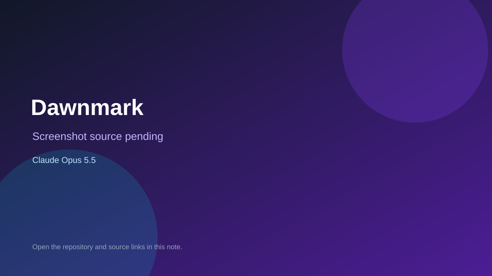

# Dawnmark

> Top-list entry: **today** (#7), **this week** (#10), **this month** (#10).

## At a glance

- **Score:** 8.1/10
- **Model:** Claude Opus 5.5
- **Technology:** Odin, Native
- **Estimated FP32 operations/s at 60 FPS:** 400,000,000 (low confidence; static estimate, not measured).
- **Rating basis:** Versioned 4X with screenshots; no playtest.
- **Verified:** 2026-10-07
- **Repository:** [https://github.com/Funashigiri/dawnmark](https://github.com/Funashigiri/dawnmark)
- **Evidence:** [direct model evidence](https://github.com/Funashigiri/dawnmark/commit/036a24d4a4bb8cc155d0030f89fe44c424b6a039)

## Screenshots

No screenshot source is recorded yet. Keep the placeholder until a repository, awesome list, or creator source provides an image.

## Model attribution

Open the evidence link above. Evidence grade: **direct model evidence**.

## Source description

2D turn-based 4X strategy on a made-up planet, versioned 0.002 to 0.018 with menu and screenshots; Opus 5.5 trailers.

### Gameplay source

- [https://github.com/Funashigiri/dawnmark/blob/main/src/main.odin](https://github.com/Funashigiri/dawnmark/blob/main/src/main.odin)
- [https://github.com/Funashigiri/dawnmark/commit/036a24d4a4bb8cc155d0030f89fe44c424b6a039](https://github.com/Funashigiri/dawnmark/commit/036a24d4a4bb8cc155d0030f89fe44c424b6a039)

## Verification notes

- **Status:** verified_source
- **Counted units in repository:** 1
- **Units covered by this note:** 1
- **Discovery:** GitHub commit pool: Opus/Sonnet game commits filtered to repos created Oct 6-7 (Asia/Ho_Chi_Minh); https://github.com/Funashigiri/dawnmark; https://github.com/Funashigiri/dawnmark/commit/036a24d4a4bb8cc155d0030f89fe44c424b6a039

[Back to the awesome list](../../README.md)
