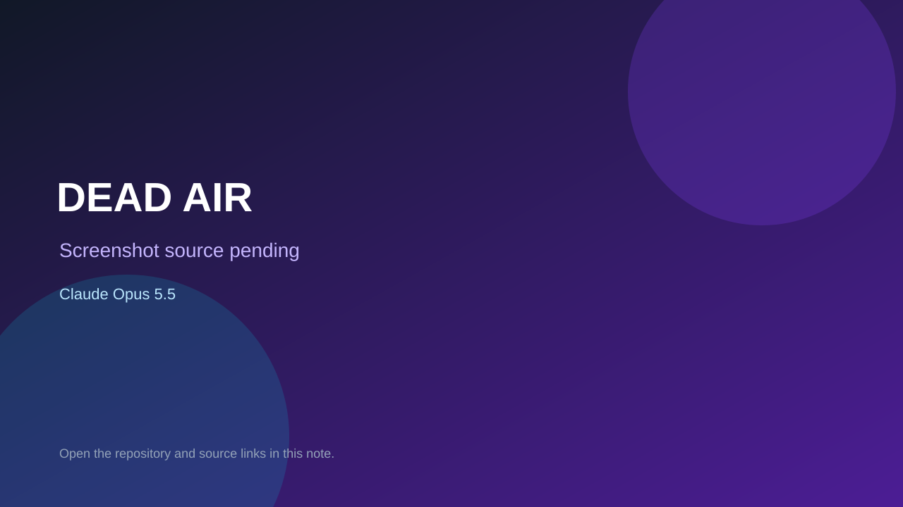

# DEAD AIR

> Top-list entry: **today** (#1), **this week** (#1), **this month** (#1).

## At a glance

- **Score:** 8.5/10
- **Model:** Claude Opus 5.5
- **Technology:** TypeScript, Browser, WebRTC
- **Estimated FP32 operations/s at 60 FPS:** 1,000,000,000 (low confidence; static estimate, not measured).
- **Rating basis:** Ambitious co-op horror with playtest history; no independent session.
- **Verified:** 2026-10-07
- **Repository:** [https://github.com/PieterMey/theboys](https://github.com/PieterMey/theboys)
- **Evidence:** [direct model evidence](https://github.com/PieterMey/theboys/commit/d4cb042d9493e086084858afff54c92b2de2d79c)

## Screenshots

No screenshot source is recorded yet. Keep the placeholder until a repository, awesome list, or creator source provides an image.

## Model attribution

Open the evidence link above. Evidence grade: **direct model evidence**.

## Source description

Co-op proximity-voice browser horror with levels, objectives, monsters, voice lures and 58 recorded playtest fixes; Opus 5.5 trailers throughout.

### Gameplay source

- [https://github.com/PieterMey/theboys/blob/main/apps/client/index.html](https://github.com/PieterMey/theboys/blob/main/apps/client/index.html)
- [https://github.com/PieterMey/theboys/commit/d4cb042d9493e086084858afff54c92b2de2d79c](https://github.com/PieterMey/theboys/commit/d4cb042d9493e086084858afff54c92b2de2d79c)

## Verification notes

- **Status:** verified_source
- **Counted units in repository:** 1
- **Units covered by this note:** 1
- **Discovery:** GitHub repository search: Built with Claude created 2026-10-06..2026-10-07; https://github.com/PieterMey/theboys; https://github.com/PieterMey/theboys/commit/d4cb042d9493e086084858afff54c92b2de2d79c

[Back to the awesome list](../../README.md)
