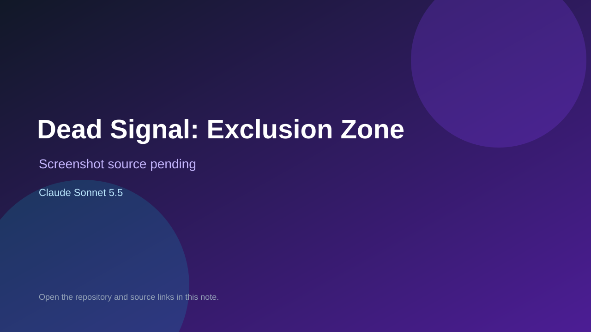

# Dead Signal: Exclusion Zone

> Top-list entry: **today** (#1).

## At a glance

- **Score:** 8.7/10
- **Model:** Claude Sonnet 5.5
- **Technology:** Three.js, TypeScript, Vite, Vitest
- **Estimated FP32 operations/s at 60 FPS:** 120,000,000 (low confidence; static estimate, not measured).
- **Rating basis:** Estimate source completeness, mechanics, documented run path, tests and attribution; do not treat this as a visual review or runtime benchmark.
- **Verified:** 2026-09-30
- **Repository:** [https://github.com/bridge-mind/sonnet-5-5-zombies-game](https://github.com/bridge-mind/sonnet-5-5-zombies-game)
- **Evidence:** [direct model evidence](https://github.com/bridge-mind/sonnet-5-5-zombies-game/commit/9294d67a8548cb851acfd1a5aafdc6d68b008ee4)

## Screenshots

No screenshot source is recorded yet. Keep the placeholder until a repository, awesome list, or creator source provides an image.

## Model attribution

Open the evidence link above. Evidence grade: **direct model evidence**.

## Source description

Inspect FPS input, zombie combat, relay defense, armored boss, gear economy, contamination deadline and helicopter extraction with defeat/victory states. Inspect the checked-in entry point and gameplay systems. Treat repository creation as a freshness proxy, not proof of game creation or publication. Do not treat this source verification as a runtime playtest.

### Gameplay source

- [https://github.com/bridge-mind/sonnet-5-5-zombies-game/blob/9294d67a8548cb851acfd1a5aafdc6d68b008ee4/src/main.ts](https://github.com/bridge-mind/sonnet-5-5-zombies-game/blob/9294d67a8548cb851acfd1a5aafdc6d68b008ee4/src/main.ts)
- [https://github.com/bridge-mind/sonnet-5-5-zombies-game/commit/9294d67a8548cb851acfd1a5aafdc6d68b008ee4](https://github.com/bridge-mind/sonnet-5-5-zombies-game/commit/9294d67a8548cb851acfd1a5aafdc6d68b008ee4)

## Verification notes

- **Status:** verified_source
- **Counted units in repository:** 1
- **Units covered by this note:** 1
- **Discovery:** GitHub model-and-date repository search; commit-attribution freshness join (September 29–30 UTC+7); https://github.com/bridge-mind/sonnet-5-5-zombies-game

[Back to the awesome list](../../README.md)
