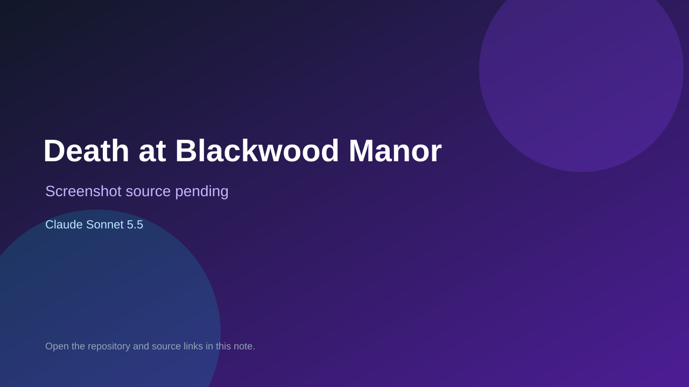

# Death at Blackwood Manor

> Top-list entry: **this month** (#8).

## At a glance

- **Score:** 7.7/10
- **Model:** Claude Sonnet 5.5
- **Technology:** HTML, CSS, JavaScript, Interactive mystery game
- **Estimated FP32 operations/s at 60 FPS:** 110,000,000 (low confidence; static estimate, not measured).
- **Rating basis:** Compact game has multiple investigation actions, evidence deduction, bounded accusation attempts and persistent play state. No independent gameplay test performed.
- **Verified:** 2026-10-02
- **Repository:** [https://github.com/Kurstin-Cyber/vigilant-telegram](https://github.com/Kurstin-Cyber/vigilant-telegram)
- **Evidence:** [direct model evidence](https://github.com/Kurstin-Cyber/vigilant-telegram/commit/4b383892a618aee034e43957580fd399d18708f4)

## Screenshots

No screenshot source is recorded yet. Keep the placeholder until a repository, awesome list, or creator source provides an image.

## Model attribution

Open the evidence link above. Evidence grade: **direct model evidence**.

## Source description

The README and single-file index implement a browser murder mystery: search rooms, question suspects, present evidence to expose lies, then name culprit, weapon and motive with three accusations. State persists in localStorage. The creation commit explicitly credits Claude Sonnet 5.5. Count the mystery game once; no public hosted demo is recorded.

### Gameplay source

- [https://github.com/Kurstin-Cyber/vigilant-telegram/blob/main/index.html](https://github.com/Kurstin-Cyber/vigilant-telegram/blob/main/index.html)
- [https://github.com/Kurstin-Cyber/vigilant-telegram/commit/4b383892a618aee034e43957580fd399d18708f4](https://github.com/Kurstin-Cyber/vigilant-telegram/commit/4b383892a618aee034e43957580fd399d18708f4)

## Verification notes

- **Status:** verified_source
- **Counted units in repository:** 1
- **Units covered by this note:** 1
- **Discovery:** GitHub commit search: "Claude Sonnet 5.5" game committer-date:2026-09-29..2026-10-02; https://github.com/Kurstin-Cyber/vigilant-telegram

[Back to the awesome list](../../README.md)
