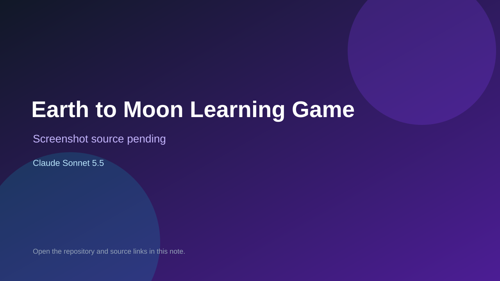

# Earth to Moon Learning Game

> Verified game note.

## At a glance

- **Score:** 8.0/10
- **Model:** Claude Sonnet 5.5
- **Technology:** Flutter, Dart, Native Android
- **Estimated FP32 operations/s at 60 FPS:** 12,000,000 (low confidence; static estimate, not measured).
- **Rating basis:** Estimate source completeness, mechanics, documented run path, tests and attribution; do not treat this as a visual review or runtime benchmark.
- **Verified:** 2026-09-30
- **Repository:** [https://github.com/drahmedyahia/yoyo](https://github.com/drahmedyahia/yoyo)
- **Evidence:** [direct model evidence](https://github.com/drahmedyahia/yoyo/commit/77049f6bc74286505eb83694aaf1b1ee98b3ee8c)

## Screenshots

No screenshot source is recorded yet. Keep the placeholder until a repository, awesome list, or creator source provides an image.

## Model attribution

Open the evidence link above. Evidence grade: **direct model evidence**.

## Source description

Inspect rocket steering/fire input, projectile collisions, monster waves, lives, score, a Moon boss and landing progression into educational questions. Keep the Flutter Android game in Non-Browser Engines. Inspect the checked-in entry point and gameplay systems. Treat repository creation as a freshness proxy, not proof of game creation or publication. Do not treat this source verification as a runtime playtest.

### Gameplay source

- [https://github.com/drahmedyahia/yoyo/blob/77049f6bc74286505eb83694aaf1b1ee98b3ee8c/lib/main.dart](https://github.com/drahmedyahia/yoyo/blob/77049f6bc74286505eb83694aaf1b1ee98b3ee8c/lib/main.dart)
- [https://github.com/drahmedyahia/yoyo/commit/77049f6bc74286505eb83694aaf1b1ee98b3ee8c](https://github.com/drahmedyahia/yoyo/commit/77049f6bc74286505eb83694aaf1b1ee98b3ee8c)

## Verification notes

- **Status:** verified_source
- **Counted units in repository:** 1
- **Units covered by this note:** 1
- **Discovery:** GitHub model-and-date repository search; commit-attribution freshness join (September 29–30 UTC+7); https://github.com/drahmedyahia/yoyo

[Back to the awesome list](../../README.md)
