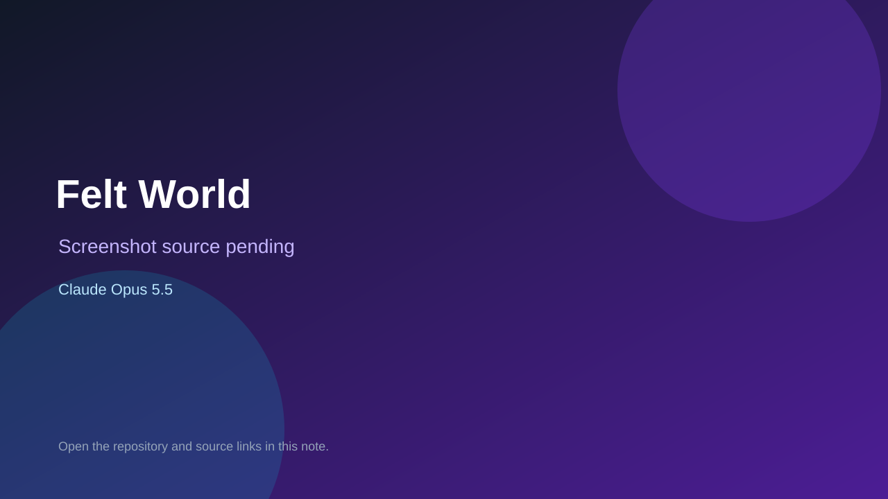

# Felt World

> Verified game note.

## At a glance

- **Score:** 7.6/10
- **Model:** Claude Opus 5.5
- **Technology:** Three.js, JavaScript, WebGL, Browser
- **Estimated FP32 operations/s at 60 FPS:** 1,000,000,000 (low confidence; static estimate, not measured).
- **Rating basis:** Conservative source-scope estimate from documented mechanics and code; not a visual rating or runtime playtest.
- **Verified:** 2026-09-28
- **Repository:** [https://github.com/az9713/opus-5.5-open-world-game](https://github.com/az9713/opus-5.5-open-world-game)
- **Evidence:** [direct model evidence](https://github.com/az9713/opus-5.5-open-world-game/commit/3ede8b7d451d765c75c3c3aacd1c7ff77901d5f4)
- **Live demo:** [open demo](https://az9713.github.io/opus-5.5-open-world-game/feltworld/)

## Screenshots

No screenshot source is recorded yet. Keep the placeholder until a repository, awesome list, or creator source provides an image.

## Model attribution

Open the evidence link above. Evidence grade: **direct model evidence**.

## Source description

Explore a procedural felt world by walking, driving, flying and diving; switch vehicles and animal forms and collect interactive music buttons. Source and primary model evidence reviewed; no interactive runtime playtest performed. Repository creation is not proof of game publication. Interactive browser smoke test: Start entered the driving world; pressing W changed the speed HUD from 0 to 2 km/h and advanced game time. This confirms a responsive control, not full game coverage.

### Gameplay source

- [https://github.com/az9713/opus-5.5-open-world-game/blob/53adf4f7be44d0ccc653f7e43b162dfdfcf079bf/feltworld/index.html](https://github.com/az9713/opus-5.5-open-world-game/blob/53adf4f7be44d0ccc653f7e43b162dfdfcf079bf/feltworld/index.html)
- [https://github.com/az9713/opus-5.5-open-world-game/commit/3ede8b7d451d765c75c3c3aacd1c7ff77901d5f4](https://github.com/az9713/opus-5.5-open-world-game/commit/3ede8b7d451d765c75c3c3aacd1c7ff77901d5f4)

## Verification notes

- **Status:** verified_source
- **Counted units in repository:** 1
- **Units covered by this note:** 1
- **Discovery:** GitHub model/game source search; creation filtered to 2026-09-21..2026-09-28 Asia/Ho_Chi_Minh; https://github.com/az9713/opus-5.5-open-world-game

[Back to the awesome list](../../README.md)
