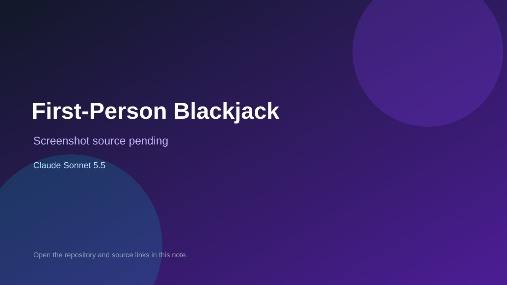

# First-Person Blackjack

> Verified game note.

## At a glance

- **Score:** 8.2/10
- **Model:** Claude Sonnet 5.5
- **Technology:** JavaScript, CSS 3D, Web Audio
- **Estimated FP32 operations/s at 60 FPS:** 12,000,000 (low confidence; static estimate, not measured).
- **Rating basis:** Estimate source completeness, mechanics, documented run path, tests and attribution; do not treat this as a visual review or runtime benchmark.
- **Verified:** 2026-09-30
- **Repository:** [https://github.com/FinDaHuman/ClaudeBlackJack](https://github.com/FinDaHuman/ClaudeBlackJack)
- **Evidence:** [direct model evidence](https://github.com/FinDaHuman/ClaudeBlackJack/commit/60d12d7e504659dd3570843af6ccbe7959d86f82)
- **Live demo:** [open demo](https://findahuman.github.io/ClaudeBlackJack/)

## Screenshots

No screenshot source is recorded yet. Keep the placeholder until a repository, awesome list, or creator source provides an image.

## Model attribution

Open the evidence link above. Evidence grade: **direct model evidence**.

## Source description

Inspect betting, six-deck settlement, hit/stand/double/split, dealer rules, bankroll persistence and rule tests. Inspect the checked-in entry point and gameplay systems. Treat repository creation as a freshness proxy, not proof of game creation or publication. Do not treat this source verification as a runtime playtest.

### Gameplay source

- [https://github.com/FinDaHuman/ClaudeBlackJack/blob/60d12d7e504659dd3570843af6ccbe7959d86f82/index.html](https://github.com/FinDaHuman/ClaudeBlackJack/blob/60d12d7e504659dd3570843af6ccbe7959d86f82/index.html)
- [https://github.com/FinDaHuman/ClaudeBlackJack/commit/60d12d7e504659dd3570843af6ccbe7959d86f82](https://github.com/FinDaHuman/ClaudeBlackJack/commit/60d12d7e504659dd3570843af6ccbe7959d86f82)

## Verification notes

- **Status:** verified_source
- **Counted units in repository:** 1
- **Units covered by this note:** 1
- **Discovery:** GitHub model-and-date repository search; commit-attribution freshness join (September 29–30 UTC+7); https://github.com/FinDaHuman/ClaudeBlackJack

[Back to the awesome list](../../README.md)
