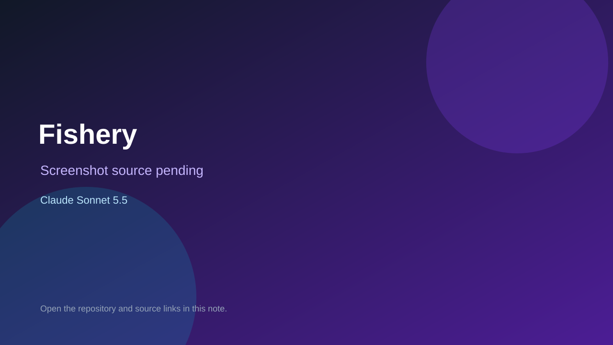

# Fishery

> Top-list entry: **today** (#6), **this month** (#11).

## At a glance

- **Score:** 7.6/10
- **Model:** Claude Sonnet 5.5
- **Technology:** HTML, CSS, JavaScript, Browser
- **Estimated FP32 operations/s at 60 FPS:** 150,000,000 (low confidence; static estimate, not measured).
- **Rating basis:** Source-backed fishing loop with collection, progression, rank perks and management upgrades, with continued game-specific work; no playtest.
- **Verified:** 2026-10-04
- **Repository:** [https://github.com/blackout-rain/application-development](https://github.com/blackout-rain/application-development)
- **Evidence:** [direct model evidence](https://github.com/blackout-rain/application-development/commit/dc674b41a13e5fe021f17e9dc8448973ec86f61a)

## Screenshots

No screenshot source is recorded yet. Keep the placeholder until a repository, awesome list, or creator source provides an image.

## Model attribution

Open the evidence link above. Evidence grade: **direct model evidence**.

## Source description

The initial game-addition commit explicitly co-authors Claude Sonnet 5.5. The fishery-game entry point contains a browser fishing and management prototype; later same-day model-attributed commits add species, rank progression, equipment, areas, bosses, and tutorial systems. Count the Fishery prototype once, not the repository’s ten separate fishing concept demos. No hosted live demo was identified or playtested.

### Gameplay source

- [https://github.com/blackout-rain/application-development/blob/claude/gracious-rubin-gl8amj/fishery-game/index.html](https://github.com/blackout-rain/application-development/blob/claude/gracious-rubin-gl8amj/fishery-game/index.html)
- [https://github.com/blackout-rain/application-development/commit/dc674b41a13e5fe021f17e9dc8448973ec86f61a](https://github.com/blackout-rain/application-development/commit/dc674b41a13e5fe021f17e9dc8448973ec86f61a)

## Verification notes

- **Status:** verified_source
- **Counted units in repository:** 1
- **Units covered by this note:** 1
- **Discovery:** GitHub commit search: Claude Sonnet 5.5 game commits dated 2026-10-04 (Asia/Ho_Chi_Minh); https://github.com/blackout-rain/application-development; https://github.com/blackout-rain/application-development/commit/dc674b41a13e5fe021f17e9dc8448973ec86f61a

[Back to the awesome list](../../README.md)
