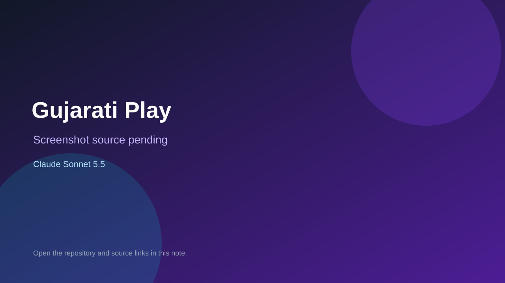

# Gujarati Play

> Top-list entry: **this month** (#5).

## At a glance

- **Score:** 7.8/10
- **Model:** Claude Sonnet 5.5
- **Technology:** HTML, CSS, JavaScript, Progressive Web App, Offline browser game
- **Estimated FP32 operations/s at 60 FPS:** 50,000,000 (low confidence; static estimate, not measured).
- **Rating basis:** Complete source-backed educational gameplay structure with structured lessons, adaptive review, writing and offline/local progress. No independent playtest performed.
- **Verified:** 2026-10-02
- **Repository:** [https://github.com/bansipatel/gujarati-play](https://github.com/bansipatel/gujarati-play)
- **Evidence:** [direct model evidence](https://github.com/bansipatel/gujarati-play/commit/be962c2424b9211f148dd1fe89308e321495181d)

## Screenshots

No screenshot source is recorded yet. Keep the placeholder until a repository, awesome list, or creator source provides an image.

## Model attribution

Open the evidence link above. Evidence grade: **direct model evidence**.

## Source description

The repository contains a no-build Gujarati literacy game with 12 lessons, separate reading and spelling practice games, distractor/question generation, session progress and spaced review. The entry point and JavaScript game runner implement player choices and feedback; local progress and offline PWA behavior are documented. The initial game commit explicitly credits Claude Sonnet 5.5. Count the product as one game, not one per lesson. It documents how users can publish a GitHub Pages build but does not provide an already deployed demo URL.

### Gameplay source

- [https://github.com/bansipatel/gujarati-play/blob/main/index.html](https://github.com/bansipatel/gujarati-play/blob/main/index.html)
- [https://github.com/bansipatel/gujarati-play/commit/be962c2424b9211f148dd1fe89308e321495181d](https://github.com/bansipatel/gujarati-play/commit/be962c2424b9211f148dd1fe89308e321495181d)

## Verification notes

- **Status:** verified_source
- **Counted units in repository:** 1
- **Units covered by this note:** 1
- **Discovery:** GitHub commit search: "Claude Sonnet 5.5" game committer-date:2026-09-29..2026-10-02; https://github.com/bansipatel/gujarati-play

[Back to the awesome list](../../README.md)
