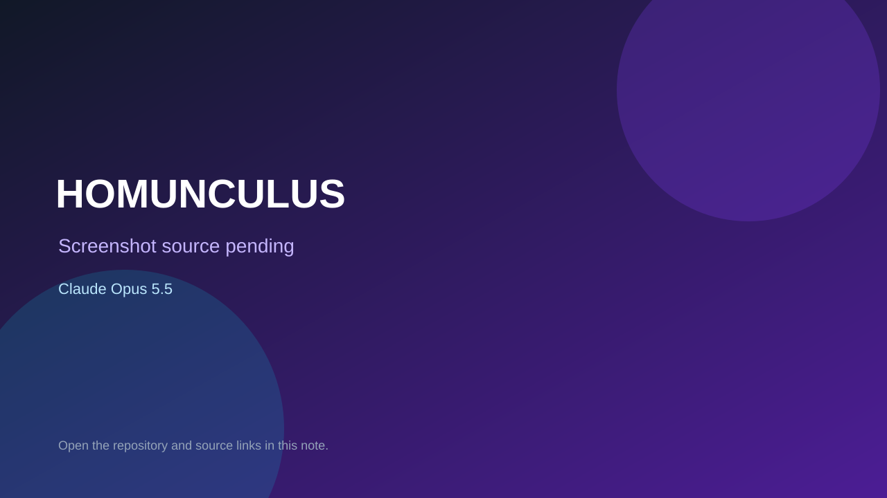

# HOMUNCULUS

> Verified game note.

## At a glance

- **Score:** 7.5/10
- **Model:** Claude Opus 5.5
- **Technology:** JavaScript, Canvas 2D, Web Audio, Browser
- **Estimated FP32 operations/s at 60 FPS:** 100,000,000 (low confidence; static estimate, not measured).
- **Rating basis:** Conservative source-scope estimate from implemented controls, rules and state; not a visual rating or runtime playtest.
- **Verified:** 2026-09-27
- **Repository:** [https://github.com/Efkrdnz/opus-test-game](https://github.com/Efkrdnz/opus-test-game)
- **Evidence:** [direct model evidence](https://github.com/Efkrdnz/opus-test-game/commit/1d70d2acdaedc4426d37da47c61096cd7b2f5d0b)

## Screenshots

No screenshot source is recorded yet. Keep the placeholder until a repository, awesome list, or creator source provides an image.

## Model attribution

Open the evidence link above. Evidence grade: **direct model evidence**.

## Source description

Mix reagents, discover recipes and administer fantasy brews to a simulated subject; interactive commands and physiological state provide an open-ended alchemy sandbox. Verify source only; do not infer runtime success or publication date from repository creation. Exclude the anatomy-layer asset sheet from gameplay screenshot evidence.

### Gameplay source

- [https://github.com/Efkrdnz/opus-test-game/blob/1d70d2acdaedc4426d37da47c61096cd7b2f5d0b/js/sim/mixer.js](https://github.com/Efkrdnz/opus-test-game/blob/1d70d2acdaedc4426d37da47c61096cd7b2f5d0b/js/sim/mixer.js)
- [https://github.com/Efkrdnz/opus-test-game/commit/1d70d2acdaedc4426d37da47c61096cd7b2f5d0b](https://github.com/Efkrdnz/opus-test-game/commit/1d70d2acdaedc4426d37da47c61096cd7b2f5d0b)

## Verification notes

- **Status:** verified_source
- **Counted units in repository:** 1
- **Units covered by this note:** 1
- **Discovery:** GitHub repository search: model/game created:2026-09-25..2026-09-27; exact creation timestamp filtered to Asia/Ho_Chi_Minh September 26–27; https://github.com/Efkrdnz/opus-test-game

[Back to the awesome list](../../README.md)
