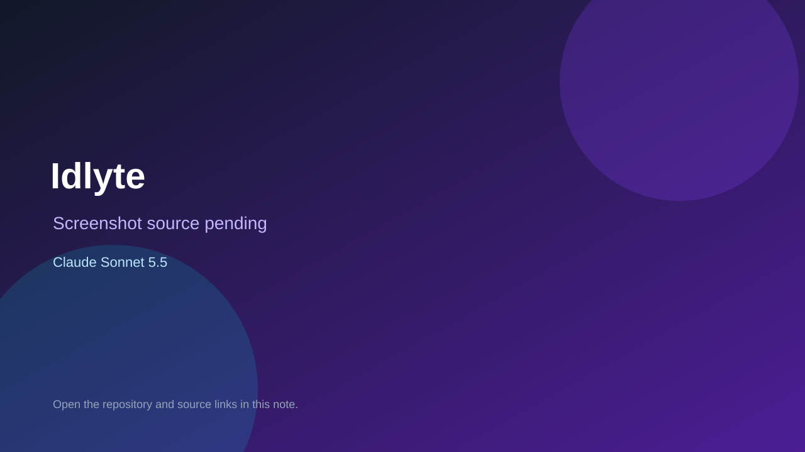

# Idlyte

> Verified game note.

## At a glance

- **Score:** 7.8/10
- **Model:** Claude Sonnet 5.5
- **Technology:** HTML, JavaScript, Idle, Browser
- **Estimated FP32 operations/s at 60 FPS:** 200,000,000 (low confidence; static estimate, not measured).
- **Rating basis:** Deep idle progression with missions, economy and bosses; no playtest.
- **Verified:** 2026-10-07
- **Repository:** [https://github.com/Deepspace000/idlyte](https://github.com/Deepspace000/idlyte)
- **Evidence:** [direct model evidence](https://github.com/Deepspace000/idlyte/commit/593d84c446a8df374259cf551154d6be4ce3b2f8)

## Screenshots

No screenshot source is recorded yet. Keep the placeholder until a repository, awesome list, or creator source provides an image.

## Model attribution

Open the evidence link above. Evidence grade: **direct model evidence**.

## Source description

Idle space shooter with missions, ship designer, bank interest and bosses; a long Sonnet 5.5 trailered commit series.

### Gameplay source

- [https://github.com/Deepspace000/idlyte/blob/main/index.html](https://github.com/Deepspace000/idlyte/blob/main/index.html)
- [https://github.com/Deepspace000/idlyte/commit/593d84c446a8df374259cf551154d6be4ce3b2f8](https://github.com/Deepspace000/idlyte/commit/593d84c446a8df374259cf551154d6be4ce3b2f8)

## Verification notes

- **Status:** verified_source
- **Counted units in repository:** 1
- **Units covered by this note:** 1
- **Discovery:** GitHub commit frontier: Sonnet/GPT-6.1 game commits joined to Oct 6-7 creations (Asia/Ho_Chi_Minh); https://github.com/Deepspace000/idlyte; https://github.com/Deepspace000/idlyte/commit/593d84c446a8df374259cf551154d6be4ce3b2f8

[Back to the awesome list](../../README.md)
