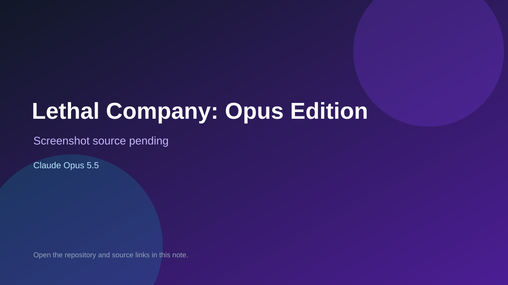

# Lethal Company: Opus Edition

> Top-list entry: **today** (#6).

## At a glance

- **Score:** 8.0/10
- **Model:** Claude Opus 5.5
- **Technology:** Three.js, JavaScript, WebGL, Browser
- **Estimated FP32 operations/s at 60 FPS:** 1,000,000,000 (low confidence; static estimate, not measured).
- **Rating basis:** Conservative source-scope estimate from implemented controls, rules and state; not a visual rating or runtime playtest.
- **Verified:** 2026-09-27
- **Repository:** [https://github.com/TESTYEE-09/opus5.5Lethal](https://github.com/TESTYEE-09/opus5.5Lethal)
- **Evidence:** [direct model evidence](https://github.com/TESTYEE-09/opus5.5Lethal/commit/298c0b204bd4ce0010a575c2322baf744fbba445)
- **Live demo:** [open demo](https://testyee-09.github.io/opus5.5Lethal/)

## Screenshots

No screenshot source is recorded yet. Keep the placeholder until a repository, awesome list, or creator source provides an image.

## Model attribution

Open the evidence link above. Evidence grade: **direct model evidence**.

## Source description

Collect scrap, avoid monsters, return to the ship and meet escalating profit quotas before the deadline; includes PeerJS co-op and keyboard/mouse controls. Verify source only; do not infer runtime success or publication date from repository creation.

### Gameplay source

- [https://github.com/TESTYEE-09/opus5.5Lethal/blob/298c0b204bd4ce0010a575c2322baf744fbba445/js/main.js](https://github.com/TESTYEE-09/opus5.5Lethal/blob/298c0b204bd4ce0010a575c2322baf744fbba445/js/main.js)
- [https://github.com/TESTYEE-09/opus5.5Lethal/commit/298c0b204bd4ce0010a575c2322baf744fbba445](https://github.com/TESTYEE-09/opus5.5Lethal/commit/298c0b204bd4ce0010a575c2322baf744fbba445)

## Verification notes

- **Status:** verified_source
- **Counted units in repository:** 1
- **Units covered by this note:** 1
- **Discovery:** GitHub repository search: model/game created:2026-09-25..2026-09-27; exact creation timestamp filtered to Asia/Ho_Chi_Minh September 26–27; https://github.com/TESTYEE-09/opus5.5Lethal

[Back to the awesome list](../../README.md)
