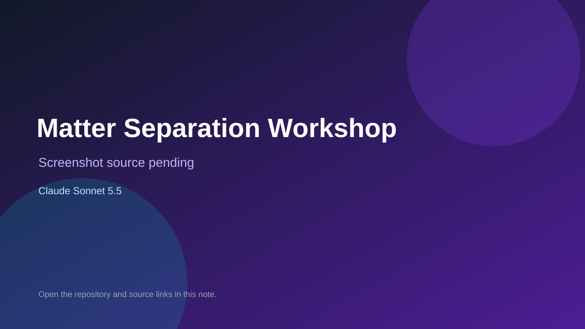

# Matter Separation Workshop

> Verified game note.

## At a glance

- **Score:** 8.0/10
- **Model:** Claude Sonnet 5.5
- **Technology:** Next.js, React, TypeScript, Zustand
- **Estimated FP32 operations/s at 60 FPS:** 12,000,000 (low confidence; static estimate, not measured).
- **Rating basis:** Estimate source completeness, mechanics, documented run path, tests and attribution; do not treat this as a visual review or runtime benchmark.
- **Verified:** 2026-09-30
- **Repository:** [https://github.com/tgtec26/snug-matter-properties-game](https://github.com/tgtec26/snug-matter-properties-game)
- **Evidence:** [direct model evidence](https://github.com/tgtec26/snug-matter-properties-game/commit/f19195f6f19dc00d2fa70931f8ede09880631d2e)

## Screenshots

No screenshot source is recorded yet. Keep the placeholder until a repository, awesome list, or creator source provides an image.

## Model attribution

Open the evidence link above. Evidence grade: **direct model evidence**.

## Source description

Inspect interactive density, solubility and boiling-point experiments, separation apparatus minigames, order progress, quizzes and results. Treat the README skeleton claim as stale; verify actual implementations rather than count plans. Inspect the checked-in entry point and gameplay systems. Treat repository creation as a freshness proxy, not proof of game creation or publication. Do not treat this source verification as a runtime playtest.

### Gameplay source

- [https://github.com/tgtec26/snug-matter-properties-game/blob/f19195f6f19dc00d2fa70931f8ede09880631d2e/app/page.tsx](https://github.com/tgtec26/snug-matter-properties-game/blob/f19195f6f19dc00d2fa70931f8ede09880631d2e/app/page.tsx)
- [https://github.com/tgtec26/snug-matter-properties-game/commit/f19195f6f19dc00d2fa70931f8ede09880631d2e](https://github.com/tgtec26/snug-matter-properties-game/commit/f19195f6f19dc00d2fa70931f8ede09880631d2e)

## Verification notes

- **Status:** verified_source
- **Counted units in repository:** 1
- **Units covered by this note:** 1
- **Discovery:** GitHub model-and-date repository search; commit-attribution freshness join (September 29–30 UTC+7); https://github.com/tgtec26/snug-matter-properties-game

[Back to the awesome list](../../README.md)
