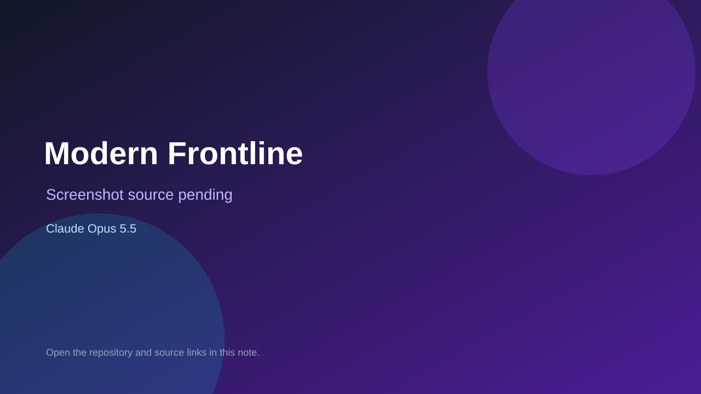

# Modern Frontline

> Top-list entry: **today** (#3).

## At a glance

- **Score:** 8.3/10
- **Model:** Claude Opus 5.5
- **Technology:** Three.js, JavaScript, WebGL, Browser
- **Estimated FP32 operations/s at 60 FPS:** 1,000,000,000 (low confidence; static estimate, not measured).
- **Rating basis:** Conservative source-scope estimate from documented mechanics and code; not a visual rating or runtime playtest.
- **Verified:** 2026-09-28
- **Repository:** [https://github.com/zty828/OPUS5.5-COD](https://github.com/zty828/OPUS5.5-COD)
- **Evidence:** [creator-reported model evidence](https://github.com/zty828/OPUS5.5-COD/blob/f30f142d4dd98d3d450ec44148fd1dc6610635de/README.md)

## Screenshots

No screenshot source is recorded yet. Keep the placeholder until a repository, awesome list, or creator source provides an image.

## Model attribution

Open the evidence link above. Evidence grade: **creator-reported model evidence**.

## Source description

Fight a seven-stage first-person campaign with checkpoints and extraction, or play AI deathmatch/control/free-for-all; track XP and loadouts. Source and primary model evidence reviewed; no interactive runtime playtest performed. Repository creation is not proof of game publication.

### Gameplay source

- [https://github.com/zty828/OPUS5.5-COD/blob/f30f142d4dd98d3d450ec44148fd1dc6610635de/js/main.js](https://github.com/zty828/OPUS5.5-COD/blob/f30f142d4dd98d3d450ec44148fd1dc6610635de/js/main.js)
- [https://github.com/zty828/OPUS5.5-COD/blob/f30f142d4dd98d3d450ec44148fd1dc6610635de/README.md](https://github.com/zty828/OPUS5.5-COD/blob/f30f142d4dd98d3d450ec44148fd1dc6610635de/README.md)

## Verification notes

- **Status:** verified_source
- **Counted units in repository:** 1
- **Units covered by this note:** 1
- **Discovery:** GitHub model/game source search; creation filtered to 2026-09-21..2026-09-28 Asia/Ho_Chi_Minh; https://github.com/zty828/OPUS5.5-COD

[Back to the awesome list](../../README.md)
