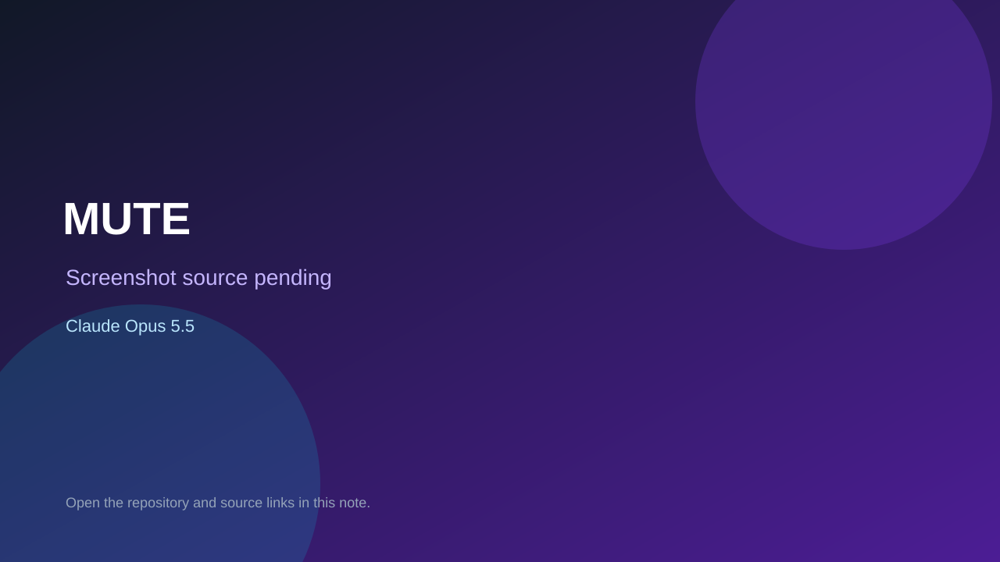

# MUTE

> Top-list entry: **today** (#2), **this week** (#3), **this month** (#3).

## At a glance

- **Score:** 8.4/10
- **Model:** Claude Opus 5.5
- **Technology:** TypeScript, WebXR, Browser
- **Estimated FP32 operations/s at 60 FPS:** 1,500,000,000 (low confidence; static estimate, not measured).
- **Rating basis:** Large tested horror codebase with netcode; no runtime session.
- **Verified:** 2026-10-07
- **Repository:** [https://github.com/dippy34/Ai-vr-game](https://github.com/dippy34/Ai-vr-game)
- **Evidence:** [direct model evidence](https://github.com/dippy34/Ai-vr-game/commit/cbd6dd0b0345775604a404ca3e880d35d13a9637)

## Screenshots

No screenshot source is recorded yet. Keep the placeholder until a repository, awesome list, or creator source provides an image.

## Model attribution

Open the evidence link above. Evidence grade: **direct model evidence**.

## Source description

Horror game for VR and desktop with rounds, jumpscare, multiplayer netcode and tests; Opus 5.5 trailers with session links.

### Gameplay source

- [https://github.com/dippy34/Ai-vr-game/blob/claude/vigilant-gates-rfgepm/src/main.ts](https://github.com/dippy34/Ai-vr-game/blob/claude/vigilant-gates-rfgepm/src/main.ts)
- [https://github.com/dippy34/Ai-vr-game/commit/cbd6dd0b0345775604a404ca3e880d35d13a9637](https://github.com/dippy34/Ai-vr-game/commit/cbd6dd0b0345775604a404ca3e880d35d13a9637)

## Verification notes

- **Status:** verified_source
- **Counted units in repository:** 1
- **Units covered by this note:** 1
- **Discovery:** GitHub commit pool: Opus/Sonnet game commits filtered to repos created Oct 6-7 (Asia/Ho_Chi_Minh); https://github.com/dippy34/Ai-vr-game; https://github.com/dippy34/Ai-vr-game/commit/cbd6dd0b0345775604a404ca3e880d35d13a9637

[Back to the awesome list](../../README.md)
