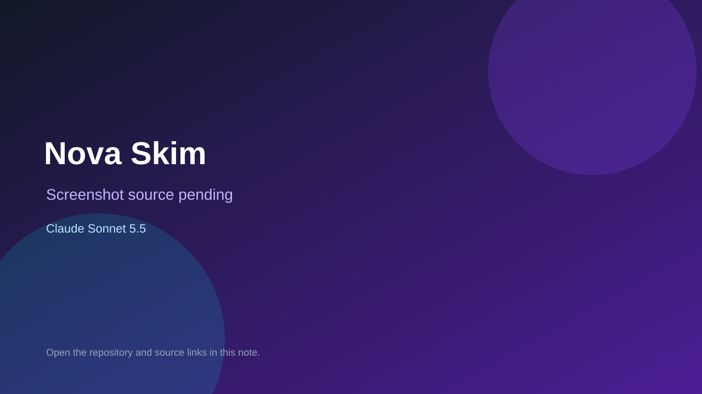

# Nova Skim

> Verified game note.

## At a glance

- **Score:** 7.8/10
- **Model:** Claude Sonnet 5.5
- **Technology:** Phaser, JavaScript, Vite, YouTube Playables SDK
- **Estimated FP32 operations/s at 60 FPS:** 12,000,000 (low confidence; static estimate, not measured).
- **Rating basis:** Estimate source completeness, mechanics, documented run path, tests and attribution; do not treat this as a visual review or runtime benchmark.
- **Verified:** 2026-09-30
- **Repository:** [https://github.com/IBassemTarek/nova-skim](https://github.com/IBassemTarek/nova-skim)
- **Evidence:** [direct model evidence](https://github.com/IBassemTarek/nova-skim/commit/6c0ad00f6c83b14538157b520f57adbbc2852006)

## Screenshots

No screenshot source is recorded yet. Keep the placeholder until a repository, awesome list, or creator source provides an image.

## Model attribution

Open the evidence link above. Evidence grade: **direct model evidence**.

## Source description

Inspect a neon orbit-hopping arcade game with launch/release input, planets and hazards, score multipliers, failure/results and best scores. Do not equate SDK integration with an accepted YouTube Playables listing. Inspect the checked-in entry point and gameplay systems. Treat repository creation as a freshness proxy, not proof of game creation or publication. Do not treat this source verification as a runtime playtest.

### Gameplay source

- [https://github.com/IBassemTarek/nova-skim/blob/6c0ad00f6c83b14538157b520f57adbbc2852006/src/main.js](https://github.com/IBassemTarek/nova-skim/blob/6c0ad00f6c83b14538157b520f57adbbc2852006/src/main.js)
- [https://github.com/IBassemTarek/nova-skim/commit/6c0ad00f6c83b14538157b520f57adbbc2852006](https://github.com/IBassemTarek/nova-skim/commit/6c0ad00f6c83b14538157b520f57adbbc2852006)

## Verification notes

- **Status:** verified_source
- **Counted units in repository:** 1
- **Units covered by this note:** 1
- **Discovery:** GitHub model-and-date repository search; commit-attribution freshness join (September 29–30 UTC+7); https://github.com/IBassemTarek/nova-skim

[Back to the awesome list](../../README.md)
