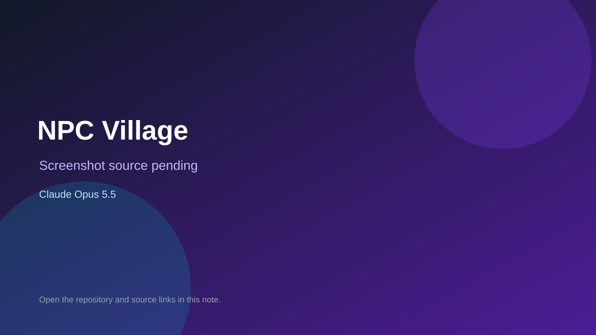

# NPC Village

> Top-list entry: **today** (#9).

## At a glance

- **Score:** 8.5/10
- **Model:** Claude Opus 5.5
- **Technology:** Godot 4.7, GDScript, Native desktop
- **Estimated FP32 operations/s at 60 FPS:** 12,000,000 (low confidence; static estimate, not measured).
- **Rating basis:** Estimate source completeness, mechanics, documented run path, tests and attribution; do not treat this as a visual review or runtime benchmark.
- **Verified:** 2026-09-30
- **Repository:** [https://github.com/LJAguil/Npc-Village](https://github.com/LJAguil/Npc-Village)
- **Evidence:** [direct model evidence](https://github.com/LJAguil/Npc-Village/commit/3dbbe7348c5abf69c2a1846d3f3cc3d7352f74e3)

## Screenshots

No screenshot source is recorded yet. Keep the placeholder until a repository, awesome list, or creator source provides an image.

## Model attribution

Open the evidence link above. Evidence grade: **direct model evidence**.

## Source description

Inspect movement, villager interactions, farming, fishing, quests, minigames, currency and the Harvest Festival win goal. Keep native Godot exports in Non-Browser Engines. Inspect the checked-in entry point and gameplay systems. Treat repository creation as a freshness proxy, not proof of game creation or publication. Do not treat this source verification as a runtime playtest.

### Gameplay source

- [https://github.com/LJAguil/Npc-Village/blob/3dbbe7348c5abf69c2a1846d3f3cc3d7352f74e3/project.godot](https://github.com/LJAguil/Npc-Village/blob/3dbbe7348c5abf69c2a1846d3f3cc3d7352f74e3/project.godot)
- [https://github.com/LJAguil/Npc-Village/commit/3dbbe7348c5abf69c2a1846d3f3cc3d7352f74e3](https://github.com/LJAguil/Npc-Village/commit/3dbbe7348c5abf69c2a1846d3f3cc3d7352f74e3)

## Verification notes

- **Status:** verified_source
- **Counted units in repository:** 1
- **Units covered by this note:** 1
- **Discovery:** GitHub model-and-date repository search; commit-attribution freshness join (September 29–30 UTC+7); https://github.com/LJAguil/Npc-Village

[Back to the awesome list](../../README.md)
