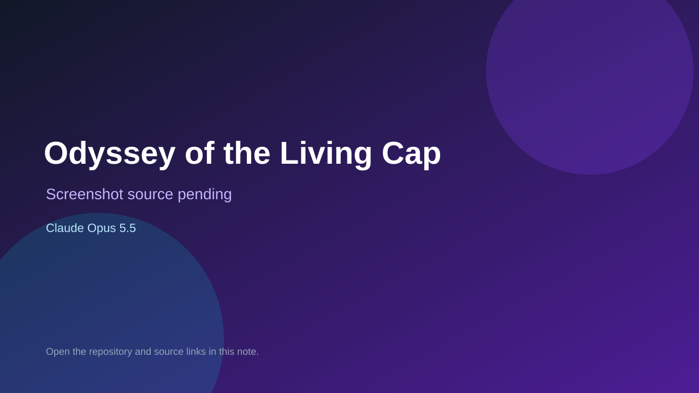

# Odyssey of the Living Cap

> Top-list entry: **today** (#3), **this month** (#4).

## At a glance

- **Score:** 8.0/10
- **Model:** Claude Opus 5.5
- **Technology:** Python, Pygame, AutoGen, Anthropic Claude
- **Estimated FP32 operations/s at 60 FPS:** 100,000,000 (low confidence; static estimate, not measured).
- **Rating basis:** Source and creator documentation describe a platformer with multiple kingdoms, collectible progression, capture abilities, enemy interaction and an ending path; no independent playtest.
- **Verified:** 2026-10-04
- **Repository:** [https://github.com/SathiyabalanSengodan/autogen-odyssey-game-studio](https://github.com/SathiyabalanSengodan/autogen-odyssey-game-studio)
- **Evidence:** [creator-reported model evidence](https://github.com/SathiyabalanSengodan/autogen-odyssey-game-studio/blob/main/README.md)

## Screenshots

No screenshot source is recorded yet. Keep the placeholder until a repository, awesome list, or creator source provides an image.

## Model attribution

Open the evidence link above. Evidence grade: **creator-reported model evidence**.

## Source description

The repository contains a runnable Pygame platform adventure in coding/odyssey.py with three kingdoms, 15 Power Moons, enemy capture and copyable powers, and an ending path. The creator identifies the approved build as produced by a four-agent AutoGen team and states Opus 5.5 wrote the game file; Claude model and effort are configurable for future runs. Count this playable output once, not the studio/generator as another game. It requires Python/Pygame and is not hosted. The smoke-test tooling executes generated code locally without a sandbox; inspect it before running. No runtime playtest was performed.

### Gameplay source

- [https://github.com/SathiyabalanSengodan/autogen-odyssey-game-studio/blob/main/coding/odyssey.py](https://github.com/SathiyabalanSengodan/autogen-odyssey-game-studio/blob/main/coding/odyssey.py)
- [https://github.com/SathiyabalanSengodan/autogen-odyssey-game-studio/blob/main/README.md](https://github.com/SathiyabalanSengodan/autogen-odyssey-game-studio/blob/main/README.md)

## Verification notes

- **Status:** verified_source
- **Counted units in repository:** 1
- **Units covered by this note:** 1
- **Discovery:** GitHub repository search: Claude Opus 5.5 game created 2026-10-03 (Asia/Ho_Chi_Minh); https://github.com/SathiyabalanSengodan/autogen-odyssey-game-studio; https://github.com/SathiyabalanSengodan/autogen-odyssey-game-studio/blob/main/README.md

[Back to the awesome list](../../README.md)
