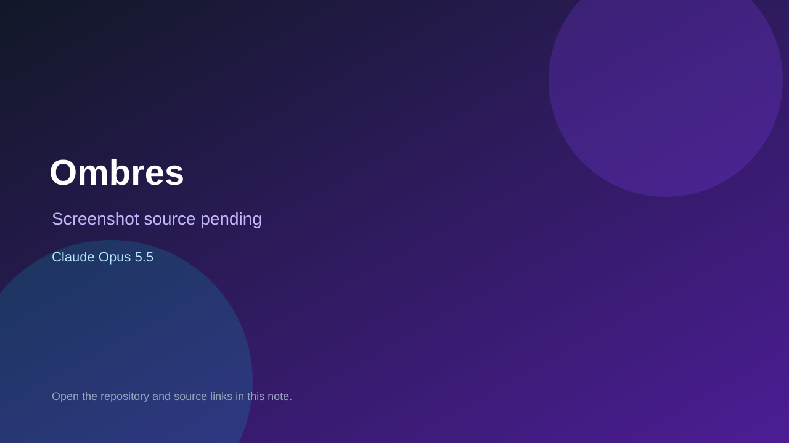

# Ombres

> Top-list entry: **today** (#10).

## At a glance

- **Score:** 8.0/10
- **Model:** Claude Opus 5.5
- **Technology:** React, Three.js, TypeScript, WebGL, Browser
- **Estimated FP32 operations/s at 60 FPS:** 1,000,000,000 (low confidence; static estimate, not measured).
- **Rating basis:** Conservative source-scope estimate from documented mechanics and code; not a visual rating or runtime playtest.
- **Verified:** 2026-09-28
- **Repository:** [https://github.com/briossant/ombres](https://github.com/briossant/ombres)
- **Evidence:** [direct model evidence](https://github.com/briossant/ombres/commit/403840d83740eee4e264e7a1cc04390b8d346787)
- **Live demo:** [open demo](https://ombres.deploy.breizhware.com/)

## Screenshots

No screenshot source is recorded yet. Keep the placeholder until a repository, awesome list, or creator source provides an image.

## Model attribution

Open the evidence link above. Evidence grade: **direct model evidence**.

## Source description

Control a creature by phone, keyboard or gamepad; paint territory, strike opponents and score across timed party-game rounds. Source and primary model evidence reviewed; no interactive runtime playtest performed. Repository creation is not proof of game publication.

### Gameplay source

- [https://github.com/briossant/ombres/blob/403840d83740eee4e264e7a1cc04390b8d346787/src/sim/rules.ts](https://github.com/briossant/ombres/blob/403840d83740eee4e264e7a1cc04390b8d346787/src/sim/rules.ts)
- [https://github.com/briossant/ombres/commit/403840d83740eee4e264e7a1cc04390b8d346787](https://github.com/briossant/ombres/commit/403840d83740eee4e264e7a1cc04390b8d346787)

## Verification notes

- **Status:** verified_source
- **Counted units in repository:** 1
- **Units covered by this note:** 1
- **Discovery:** GitHub model/game source search; creation filtered to 2026-09-21..2026-09-28 Asia/Ho_Chi_Minh; https://github.com/briossant/ombres

[Back to the awesome list](../../README.md)
