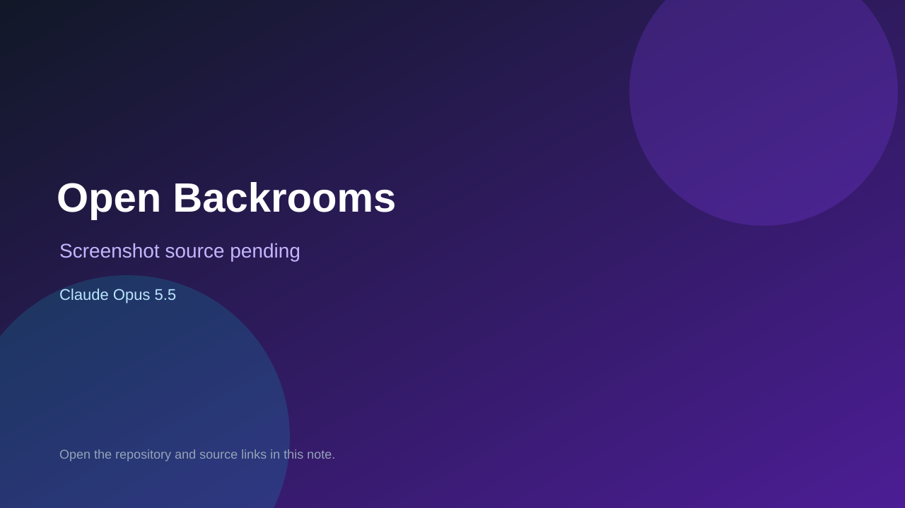

# Open Backrooms

> Top-list entry: **today** (#10).

## At a glance

- **Score:** 8.5/10
- **Model:** Claude Opus 5.5
- **Technology:** Three.js, TypeScript, Vite, WebSocket
- **Estimated FP32 operations/s at 60 FPS:** 120,000,000 (low confidence; static estimate, not measured).
- **Rating basis:** Estimate source completeness, mechanics, documented run path, tests and attribution; do not treat this as a visual review or runtime benchmark.
- **Verified:** 2026-09-30
- **Repository:** [https://github.com/awn3x/Open-Backrooms](https://github.com/awn3x/Open-Backrooms)
- **Evidence:** [direct model evidence](https://github.com/awn3x/Open-Backrooms/commit/ec3c618ed48b33ab7a2d9fc3d69781f68c0bc184)
- **Live demo:** [open demo](https://awn3x.github.io/Open-Backrooms/)

## Screenshots

No screenshot source is recorded yet. Keep the placeholder until a repository, awesome list, or creator source provides an image.

## Model attribution

Open the evidence link above. Evidence grade: **direct model evidence**.

## Source description

Inspect FPS movement, three procedural horror levels, hostile entities, health/death, exploration currency, safe-zone interactions and an offline AI mode. Do not assume multiplayer services work merely from source. Inspect the checked-in entry point and gameplay systems. Treat repository creation as a freshness proxy, not proof of game creation or publication. Do not treat this source verification as a runtime playtest.

### Gameplay source

- [https://github.com/awn3x/Open-Backrooms/blob/15c7a727dd37133c8a95b5abe50769a656abb934/src/game/main.ts](https://github.com/awn3x/Open-Backrooms/blob/15c7a727dd37133c8a95b5abe50769a656abb934/src/game/main.ts)
- [https://github.com/awn3x/Open-Backrooms/commit/ec3c618ed48b33ab7a2d9fc3d69781f68c0bc184](https://github.com/awn3x/Open-Backrooms/commit/ec3c618ed48b33ab7a2d9fc3d69781f68c0bc184)

## Verification notes

- **Status:** verified_source
- **Counted units in repository:** 1
- **Units covered by this note:** 1
- **Discovery:** GitHub model-and-date repository search; commit-attribution freshness join (September 29–30 UTC+7); https://github.com/awn3x/Open-Backrooms

[Back to the awesome list](../../README.md)
