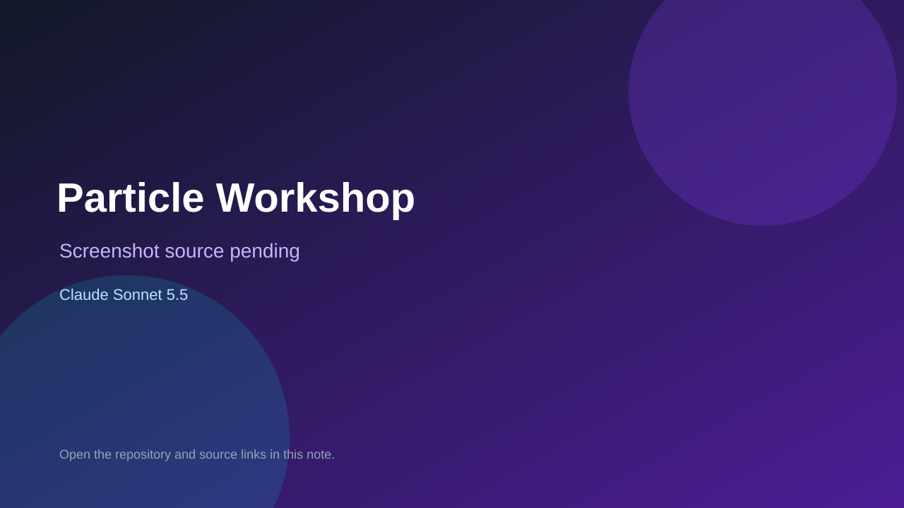

# Particle Workshop

> Verified game note.

## At a glance

- **Score:** 8.0/10
- **Model:** Claude Sonnet 5.5
- **Technology:** Next.js, React, TypeScript, Phaser, Zustand
- **Estimated FP32 operations/s at 60 FPS:** 12,000,000 (low confidence; static estimate, not measured).
- **Rating basis:** Estimate source completeness, mechanics, documented run path, tests and attribution; do not treat this as a visual review or runtime benchmark.
- **Verified:** 2026-09-30
- **Repository:** [https://github.com/tgtec26/snug-matter-composition-game](https://github.com/tgtec26/snug-matter-composition-game)
- **Evidence:** [direct model evidence](https://github.com/tgtec26/snug-matter-composition-game/commit/2a81bdf79ab5945ff79f53e37c33efe60eec22a3)
- **Live demo:** [open demo](https://snug-matter-composition-game.vercel.app/)

## Screenshots

No screenshot source is recorded yet. Keep the placeholder until a repository, awesome list, or creator source provides an image.

## Model attribution

Open the evidence link above. Evidence grade: **direct model evidence**.

## Source description

Inspect implemented atom-building controls, identity/star rules, periodic-table tasks, molecules, ion work, orders, quizzes and ending progression. Treat the README skeleton claim as stale: the inspected source now connects playable overlays and completion state. Inspect the checked-in entry point and gameplay systems. Treat repository creation as a freshness proxy, not proof of game creation or publication. Do not treat this source verification as a runtime playtest.

### Gameplay source

- [https://github.com/tgtec26/snug-matter-composition-game/blob/2a81bdf79ab5945ff79f53e37c33efe60eec22a3/app/page.tsx](https://github.com/tgtec26/snug-matter-composition-game/blob/2a81bdf79ab5945ff79f53e37c33efe60eec22a3/app/page.tsx)
- [https://github.com/tgtec26/snug-matter-composition-game/commit/2a81bdf79ab5945ff79f53e37c33efe60eec22a3](https://github.com/tgtec26/snug-matter-composition-game/commit/2a81bdf79ab5945ff79f53e37c33efe60eec22a3)

## Verification notes

- **Status:** verified_source
- **Counted units in repository:** 1
- **Units covered by this note:** 1
- **Discovery:** GitHub model-and-date repository search; commit-attribution freshness join (September 29–30 UTC+7); https://github.com/tgtec26/snug-matter-composition-game

[Back to the awesome list](../../README.md)
