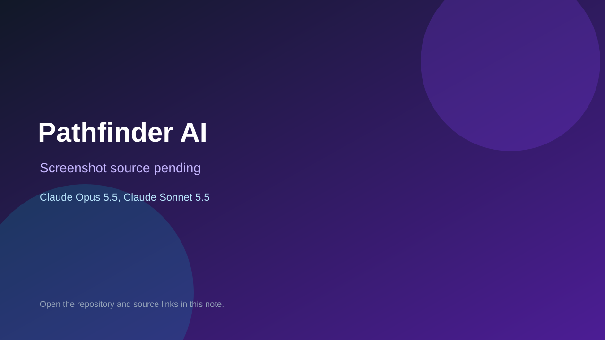

# Pathfinder AI

> Verified game note.

## At a glance

- **Score:** 7.6/10
- **Model:** Claude Opus 5.5, Claude Sonnet 5.5
- **Technology:** TypeScript, React, Next.js, Browser
- **Estimated FP32 operations/s at 60 FPS:** 300,000,000 (low confidence; static estimate, not measured).
- **Rating basis:** Explorable world with a dozen playable mini simulations; no playtest.
- **Verified:** 2026-10-07
- **Repository:** [https://github.com/mzeeshanaltaf/pathfinder-ai](https://github.com/mzeeshanaltaf/pathfinder-ai)
- **Evidence:** [direct model evidence](https://github.com/mzeeshanaltaf/pathfinder-ai/commit/48a6993482dfab5afa10e65090abde5b3e84233a)

## Screenshots

No screenshot source is recorded yet. Keep the placeholder until a repository, awesome list, or creator source provides an image.

## Model attribution

Open the evidence link above. Evidence grade: **direct model evidence**.

## Source description

First-person learning world with a mini-game framework and 12 concept simulations; phases 1-3 co-author Opus 5.5 and phases 4-5 Sonnet 5.5.

### Gameplay source

- [https://github.com/mzeeshanaltaf/pathfinder-ai/blob/main/app/page.tsx](https://github.com/mzeeshanaltaf/pathfinder-ai/blob/main/app/page.tsx)
- [https://github.com/mzeeshanaltaf/pathfinder-ai/commit/48a6993482dfab5afa10e65090abde5b3e84233a](https://github.com/mzeeshanaltaf/pathfinder-ai/commit/48a6993482dfab5afa10e65090abde5b3e84233a)

## Verification notes

- **Status:** verified_source
- **Counted units in repository:** 1
- **Units covered by this note:** 1
- **Discovery:** GitHub commit frontier: Sonnet/GPT-6.1 game commits joined to Oct 6-7 creations (Asia/Ho_Chi_Minh); https://github.com/mzeeshanaltaf/pathfinder-ai; https://github.com/mzeeshanaltaf/pathfinder-ai/commit/48a6993482dfab5afa10e65090abde5b3e84233a

[Back to the awesome list](../../README.md)
