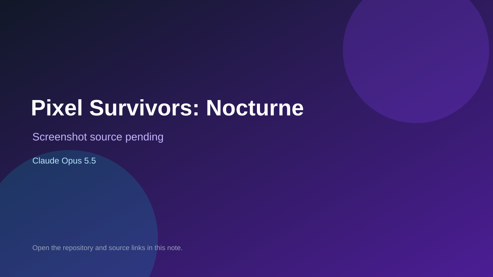

# Pixel Survivors: Nocturne

> Top-list entry: **today** (#6).

## At a glance

- **Score:** 8.1/10
- **Model:** Claude Opus 5.5
- **Technology:** JavaScript, HTML, Canvas 2D, Browser
- **Estimated FP32 operations/s at 60 FPS:** 100,000,000 (low confidence; static estimate, not measured).
- **Rating basis:** Conservative source-scope estimate from documented mechanics and code; not a visual rating or runtime playtest.
- **Verified:** 2026-09-28
- **Repository:** [https://github.com/Black2856/pixel_survivors_opus5.5test](https://github.com/Black2856/pixel_survivors_opus5.5test)
- **Evidence:** [direct model evidence](https://github.com/Black2856/pixel_survivors_opus5.5test/commit/f3ee447273c7633ed649a219a98f8d955ee13339)

## Screenshots

No screenshot source is recorded yet. Keep the placeholder until a repository, awesome list, or creator source provides an image.

## Model attribution

Open the evidence link above. Evidence grade: **direct model evidence**.

## Source description

Survive waves and bosses with movement, dash and attacks; pick level upgrades, evolve weapons and spend persistent gold. Source and primary model evidence reviewed; no interactive runtime playtest performed. Repository creation is not proof of game publication.

### Gameplay source

- [https://github.com/Black2856/pixel_survivors_opus5.5test/blob/a65a2759871671cab6b4a5763c665e366e4c76da/js/world.js](https://github.com/Black2856/pixel_survivors_opus5.5test/blob/a65a2759871671cab6b4a5763c665e366e4c76da/js/world.js)
- [https://github.com/Black2856/pixel_survivors_opus5.5test/commit/f3ee447273c7633ed649a219a98f8d955ee13339](https://github.com/Black2856/pixel_survivors_opus5.5test/commit/f3ee447273c7633ed649a219a98f8d955ee13339)

## Verification notes

- **Status:** verified_source
- **Counted units in repository:** 1
- **Units covered by this note:** 1
- **Discovery:** GitHub model/game source search; creation filtered to 2026-09-21..2026-09-28 Asia/Ho_Chi_Minh; https://github.com/Black2856/pixel_survivors_opus5.5test

[Back to the awesome list](../../README.md)
