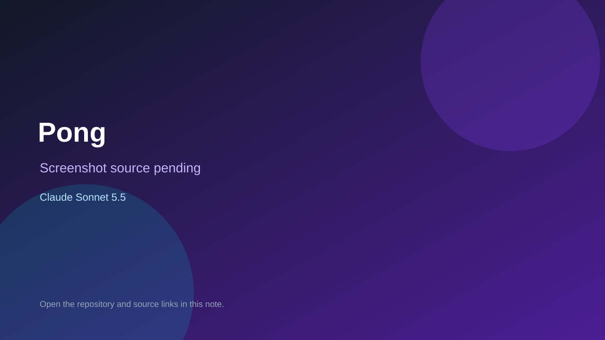

# Pong

> Verified game note.

## At a glance

- **Score:** 7.0/10
- **Model:** Claude Sonnet 5.5
- **Technology:** Python
- **Estimated FP32 operations/s at 60 FPS:** 50,000,000 (low confidence; static estimate, not measured).
- **Rating basis:** Minimal but complete Pong loop with scoring and restart; no playtest.
- **Verified:** 2026-10-07
- **Repository:** [https://github.com/nvalencio/teste](https://github.com/nvalencio/teste)
- **Evidence:** [direct model evidence](https://github.com/nvalencio/teste/commit/6002785bb01a1fde7f4730748e9a0b1fbbda950f)

## Screenshots

No screenshot source is recorded yet. Keep the placeholder until a repository, awesome list, or creator source provides an image.

## Model attribution

Open the evidence link above. Evidence grade: **direct model evidence**.

## Source description

Pong clone built commit by commit (paddles, ball physics, scoring, win condition, restart) under Sonnet 5.5 trailers; README documents controls and rules.

### Gameplay source

- [https://github.com/nvalencio/teste/blob/main/pingpong.py](https://github.com/nvalencio/teste/blob/main/pingpong.py)
- [https://github.com/nvalencio/teste/commit/6002785bb01a1fde7f4730748e9a0b1fbbda950f](https://github.com/nvalencio/teste/commit/6002785bb01a1fde7f4730748e9a0b1fbbda950f)

## Verification notes

- **Status:** verified_source
- **Counted units in repository:** 1
- **Units covered by this note:** 1
- **Discovery:** GitHub commit frontier: Sonnet/GPT-6.1 game commits joined to Oct 6-7 creations (Asia/Ho_Chi_Minh); https://github.com/nvalencio/teste; https://github.com/nvalencio/teste/commit/6002785bb01a1fde7f4730748e9a0b1fbbda950f

[Back to the awesome list](../../README.md)
