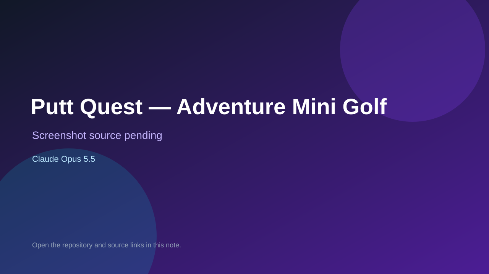

# Putt Quest — Adventure Mini Golf

> Verified game note.

## At a glance

- **Score:** 8.5/10
- **Model:** Claude Opus 5.5
- **Technology:** Three.js, JavaScript, Vite, Web Audio
- **Estimated FP32 operations/s at 60 FPS:** 120,000,000 (low confidence; static estimate, not measured).
- **Rating basis:** Estimate source completeness, mechanics, documented run path, tests and attribution; do not treat this as a visual review or runtime benchmark.
- **Verified:** 2026-09-30
- **Repository:** [https://github.com/leonvanzyl/3d-golf-sonnet](https://github.com/leonvanzyl/3d-golf-sonnet)
- **Evidence:** [direct model evidence](https://github.com/leonvanzyl/3d-golf-sonnet/commit/1ac26b49faa4686236c46128550fd32f2ea357a7)
- **Live demo:** [open demo](https://3d-golf-sonnet.vercel.app/)

## Screenshots

No screenshot source is recorded yet. Keep the placeholder until a repository, awesome list, or creator source provides an image.

## Model attribution

Open the evidence link above. Evidence grade: **direct model evidence**.

## Source description

Inspect nine themed golf holes, aim/charge/putt input, collision physics, penalty strokes, scorecards and the headless solver. Use the exact Opus 5.5 implementation trailer despite the sonnet repository slug. Inspect the checked-in entry point and gameplay systems. Treat repository creation as a freshness proxy, not proof of game creation or publication. Do not treat this source verification as a runtime playtest.

### Gameplay source

- [https://github.com/leonvanzyl/3d-golf-sonnet/blob/1ac26b49faa4686236c46128550fd32f2ea357a7/src/main.js](https://github.com/leonvanzyl/3d-golf-sonnet/blob/1ac26b49faa4686236c46128550fd32f2ea357a7/src/main.js)
- [https://github.com/leonvanzyl/3d-golf-sonnet/commit/1ac26b49faa4686236c46128550fd32f2ea357a7](https://github.com/leonvanzyl/3d-golf-sonnet/commit/1ac26b49faa4686236c46128550fd32f2ea357a7)

## Verification notes

- **Status:** verified_source
- **Counted units in repository:** 1
- **Units covered by this note:** 1
- **Discovery:** GitHub model-and-date repository search; commit-attribution freshness join (September 29–30 UTC+7); https://github.com/leonvanzyl/3d-golf-sonnet

[Back to the awesome list](../../README.md)
