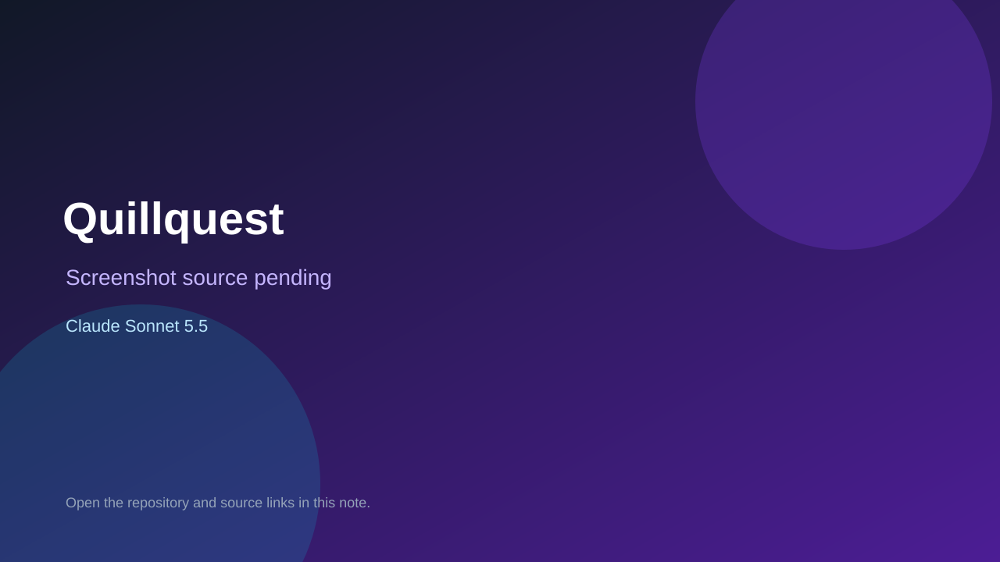

# Quillquest

> Verified game note.

## At a glance

- **Score:** 7.5/10
- **Model:** Claude Sonnet 5.5
- **Technology:** TypeScript, Next.js, Node
- **Estimated FP32 operations/s at 60 FPS:** 200,000,000 (low confidence; static estimate, not measured).
- **Rating basis:** Rules engine plus client with tested game routes; no live play session.
- **Verified:** 2026-10-07
- **Repository:** [https://github.com/CptCliff/quillquest](https://github.com/CptCliff/quillquest)
- **Evidence:** [direct model evidence](https://github.com/CptCliff/quillquest/commit/a83ad7c6f7d7306b3904a9c384575f3cf3fd033a)

## Screenshots

No screenshot source is recorded yet. Keep the placeholder until a repository, awesome list, or creator source provides an image.

## Model attribution

Open the evidence link above. Evidence grade: **direct model evidence**.

## Source description

Story and card game platform with a rules engine, dice rolls, sync server, web client and game tests; Sonnet 5.5 trailers with session links.

### Gameplay source

- [https://github.com/CptCliff/quillquest/blob/main/apps/web/app/page.tsx](https://github.com/CptCliff/quillquest/blob/main/apps/web/app/page.tsx)
- [https://github.com/CptCliff/quillquest/commit/a83ad7c6f7d7306b3904a9c384575f3cf3fd033a](https://github.com/CptCliff/quillquest/commit/a83ad7c6f7d7306b3904a9c384575f3cf3fd033a)

## Verification notes

- **Status:** verified_source
- **Counted units in repository:** 1
- **Units covered by this note:** 1
- **Discovery:** GitHub commit frontier: Sonnet/GPT-6.1 game commits joined to Oct 6-7 creations (Asia/Ho_Chi_Minh); https://github.com/CptCliff/quillquest; https://github.com/CptCliff/quillquest/commit/a83ad7c6f7d7306b3904a9c384575f3cf3fd033a

[Back to the awesome list](../../README.md)
