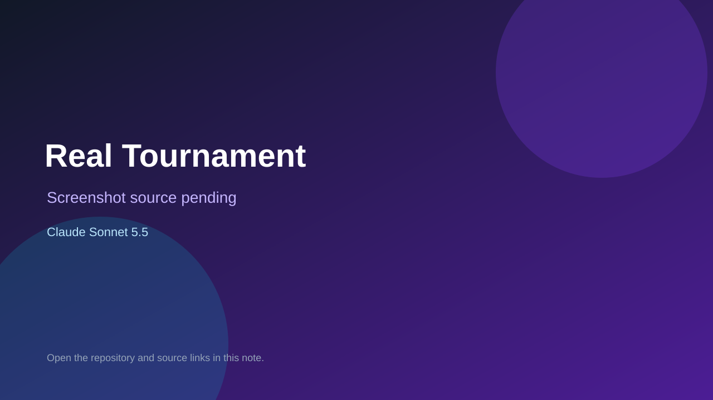

# Real Tournament

> Top-list entry: **today** (#8), **this week** (#11), **this month** (#11).

## At a glance

- **Score:** 8.1/10
- **Model:** Claude Sonnet 5.5
- **Technology:** TypeScript, Browser, Multiplayer
- **Estimated FP32 operations/s at 60 FPS:** 800,000,000 (low confidence; static estimate, not measured).
- **Rating basis:** Real multiplayer systems with bots and lobby; no live match test.
- **Verified:** 2026-10-07
- **Repository:** [https://github.com/nurullinm/real-tournament](https://github.com/nurullinm/real-tournament)
- **Evidence:** [direct model evidence](https://github.com/nurullinm/real-tournament/commit/28ab143144c7ae20925ae83f505c17a864a14544)

## Screenshots

No screenshot source is recorded yet. Keep the placeholder until a repository, awesome list, or creator source provides an image.

## Model attribution

Open the evidence link above. Evidence grade: **direct model evidence**.

## Source description

Online capture the flag 2v2 with rollback, lobbies, bots and a Telegram bot; Sonnet 5.5 trailers.

### Gameplay source

- [https://github.com/nurullinm/real-tournament/blob/main/index.html](https://github.com/nurullinm/real-tournament/blob/main/index.html)
- [https://github.com/nurullinm/real-tournament/commit/28ab143144c7ae20925ae83f505c17a864a14544](https://github.com/nurullinm/real-tournament/commit/28ab143144c7ae20925ae83f505c17a864a14544)

## Verification notes

- **Status:** verified_source
- **Counted units in repository:** 1
- **Units covered by this note:** 1
- **Discovery:** GitHub commit pool: Opus/Sonnet game commits filtered to repos created Oct 6-7 (Asia/Ho_Chi_Minh); https://github.com/nurullinm/real-tournament; https://github.com/nurullinm/real-tournament/commit/28ab143144c7ae20925ae83f505c17a864a14544

[Back to the awesome list](../../README.md)
