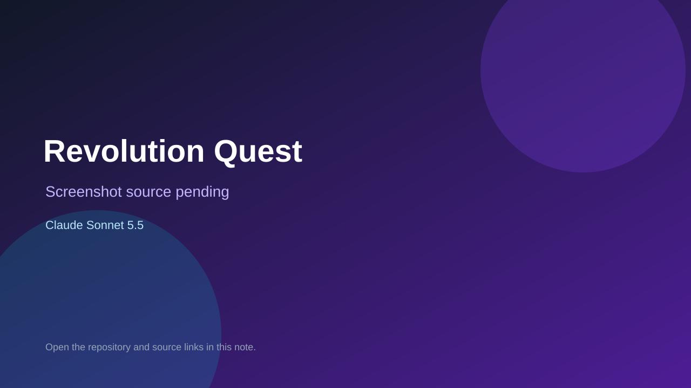

# Revolution Quest

> Verified game note.

## At a glance

- **Score:** 7.3/10
- **Model:** Claude Sonnet 5.5
- **Technology:** HTML, JavaScript, Browser
- **Estimated FP32 operations/s at 60 FPS:** 100,000,000 (low confidence; static estimate, not measured).
- **Rating basis:** Structured quiz game with landing page; no playtest.
- **Verified:** 2026-10-07
- **Repository:** [https://github.com/lydonb/clark-quizzes](https://github.com/lydonb/clark-quizzes)
- **Evidence:** [direct model evidence](https://github.com/lydonb/clark-quizzes/commit/59805d056b24c85e82559d07d9f1ca1f9c8d0ed1)

## Screenshots

No screenshot source is recorded yet. Keep the placeholder until a repository, awesome list, or creator source provides an image.

## Model attribution

Open the evidence link above. Evidence grade: **direct model evidence**.

## Source description

Revolution Quest study game with landing page; Sonnet 5.5 trailers on the game commits.

### Gameplay source

- [https://github.com/lydonb/clark-quizzes/blob/main/american-revolution/index.html](https://github.com/lydonb/clark-quizzes/blob/main/american-revolution/index.html)
- [https://github.com/lydonb/clark-quizzes/commit/59805d056b24c85e82559d07d9f1ca1f9c8d0ed1](https://github.com/lydonb/clark-quizzes/commit/59805d056b24c85e82559d07d9f1ca1f9c8d0ed1)

## Verification notes

- **Status:** verified_source
- **Counted units in repository:** 1
- **Units covered by this note:** 1
- **Discovery:** GitHub commit frontier: Sonnet/GPT-6.1 game commits joined to Oct 6-7 creations (Asia/Ho_Chi_Minh); https://github.com/lydonb/clark-quizzes; https://github.com/lydonb/clark-quizzes/commit/59805d056b24c85e82559d07d9f1ca1f9c8d0ed1

[Back to the awesome list](../../README.md)
