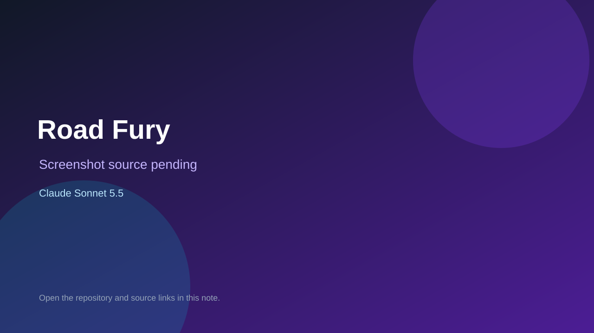

# Road Fury

> Verified game note.

## At a glance

- **Score:** 7.4/10
- **Model:** Claude Sonnet 5.5
- **Technology:** HTML, JavaScript, Canvas, Browser
- **Estimated FP32 operations/s at 60 FPS:** 300,000,000 (low confidence; static estimate, not measured).
- **Rating basis:** Source backed driving game with a live demo; no full playthrough performed.
- **Verified:** 2026-10-07
- **Repository:** [https://github.com/ouattaraymichel/Gamescar](https://github.com/ouattaraymichel/Gamescar)
- **Evidence:** [direct model evidence](https://github.com/ouattaraymichel/Gamescar/commit/344ff5c16a66a1c6cc226e5867590a04e279efa8)
- **Live demo:** [open demo](https://gamescar.vercel.app)

## Screenshots

No screenshot source is recorded yet. Keep the placeholder until a repository, awesome list, or creator source provides an image.

## Model attribution

Open the evidence link above. Evidence grade: **direct model evidence**.

## Source description

Road Fury car game; the initial commit co-authors Claude Sonnet 5.5 and the Vercel demo returned HTTP 200.

### Gameplay source

- [https://github.com/ouattaraymichel/Gamescar/blob/main/index.html](https://github.com/ouattaraymichel/Gamescar/blob/main/index.html)
- [https://github.com/ouattaraymichel/Gamescar/commit/344ff5c16a66a1c6cc226e5867590a04e279efa8](https://github.com/ouattaraymichel/Gamescar/commit/344ff5c16a66a1c6cc226e5867590a04e279efa8)

## Verification notes

- **Status:** verified_source
- **Counted units in repository:** 1
- **Units covered by this note:** 1
- **Discovery:** GitHub commit frontier: Sonnet/GPT-6.1 game commits joined to Oct 6-7 creations (Asia/Ho_Chi_Minh); https://github.com/ouattaraymichel/Gamescar; https://github.com/ouattaraymichel/Gamescar/commit/344ff5c16a66a1c6cc226e5867590a04e279efa8

[Back to the awesome list](../../README.md)
