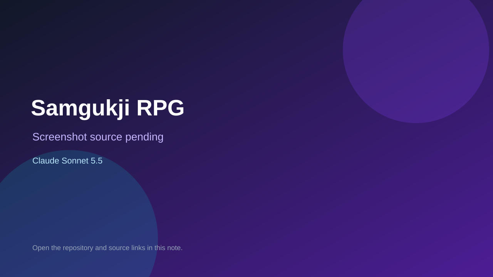

# Samgukji RPG

> Verified game note.

## At a glance

- **Score:** 7.7/10
- **Model:** Claude Sonnet 5.5
- **Technology:** TypeScript, React, Browser
- **Estimated FP32 operations/s at 60 FPS:** 500,000,000 (low confidence; static estimate, not measured).
- **Rating basis:** Battle sandbox with units, buffs and rebalance history; no playtest.
- **Verified:** 2026-10-07
- **Repository:** [https://github.com/moonhyungjin/samgukji-rpg](https://github.com/moonhyungjin/samgukji-rpg)
- **Evidence:** [direct model evidence](https://github.com/moonhyungjin/samgukji-rpg/commit/3afba1ad0068cf2c9e1b631c75ef7ab4ab339311)

## Screenshots

No screenshot source is recorded yet. Keep the placeholder until a repository, awesome list, or creator source provides an image.

## Model attribution

Open the evidence link above. Evidence grade: **direct model evidence**.

## Source description

Three Kingdoms RPG combat sandbox with a game screen, guard mechanic and balance lab; Sonnet 5.5 trailers.

### Gameplay source

- [https://github.com/moonhyungjin/samgukji-rpg/blob/main/apps/game/index.html](https://github.com/moonhyungjin/samgukji-rpg/blob/main/apps/game/index.html)
- [https://github.com/moonhyungjin/samgukji-rpg/commit/3afba1ad0068cf2c9e1b631c75ef7ab4ab339311](https://github.com/moonhyungjin/samgukji-rpg/commit/3afba1ad0068cf2c9e1b631c75ef7ab4ab339311)

## Verification notes

- **Status:** verified_source
- **Counted units in repository:** 1
- **Units covered by this note:** 1
- **Discovery:** GitHub commit frontier: Sonnet/GPT-6.1 game commits joined to Oct 6-7 creations (Asia/Ho_Chi_Minh); https://github.com/moonhyungjin/samgukji-rpg; https://github.com/moonhyungjin/samgukji-rpg/commit/3afba1ad0068cf2c9e1b631c75ef7ab4ab339311

[Back to the awesome list](../../README.md)
