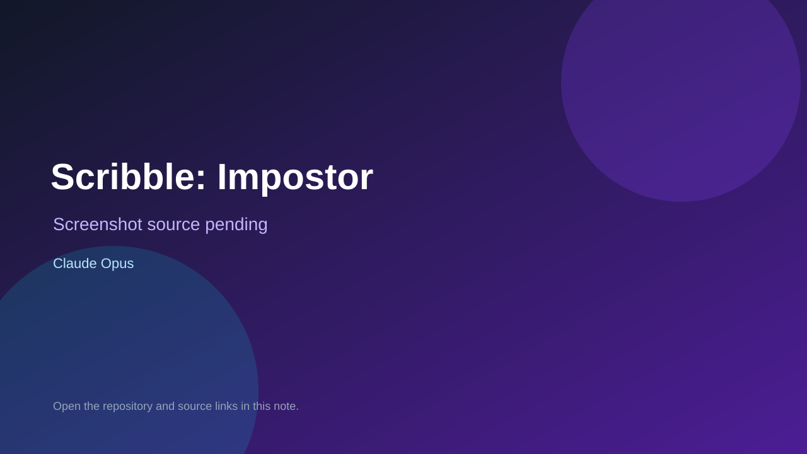

# Scribble: Impostor

> Verified game note.

## At a glance

- **Score:** 7.9/10
- **Model:** Claude Opus
- **Technology:** Node.js, Express, Socket.io, JavaScript, HTML Canvas, Browser
- **Estimated FP32 operations/s at 60 FPS:** 100,000,000 (low confidence; static estimate, not measured).
- **Rating basis:** Conservative source-scope estimate from implemented multiplayer rounds, rules and state; not a visual rating or runtime playtest.
- **Verified:** 2026-09-28
- **Repository:** [https://github.com/Anshul1336/scribble-impostor](https://github.com/Anshul1336/scribble-impostor)
- **Evidence:** [creator-reported model evidence](https://github.com/Anshul1336/scribble-impostor/blob/eef6f8737d05212bb00b673946d068237d96e731/README.md)
- **Live demo:** [open demo](https://scribble-impostor.onrender.com/)

## Screenshots

No screenshot source is recorded yet. Keep the placeholder until a repository, awesome list, or creator source provides an image.

## Model attribution

Open the evidence link above. Evidence grade: **creator-reported model evidence**.

## Source description

Host a 3–8-player drawing room and choose 3–20 rounds. The Artist draws a secret word on a synchronized canvas; guessers score by speed while an Impostor who also knows the word tries to evade a majority vote. Final round scores determine the winner. Initial source implementation was committed on 2026-09-27 UTC; README credits Claude Code / Claude Opus without a version. HTTP availability is not a multiplayer playtest. Repository creation is not proof of game publication.

### Gameplay source

- [https://github.com/Anshul1336/scribble-impostor/blob/eef6f8737d05212bb00b673946d068237d96e731/server.js](https://github.com/Anshul1336/scribble-impostor/blob/eef6f8737d05212bb00b673946d068237d96e731/server.js)
- [https://github.com/Anshul1336/scribble-impostor/blob/eef6f8737d05212bb00b673946d068237d96e731/README.md](https://github.com/Anshul1336/scribble-impostor/blob/eef6f8737d05212bb00b673946d068237d96e731/README.md)

## Verification notes

- **Status:** verified_source
- **Counted units in repository:** 1
- **Units covered by this note:** 1
- **Discovery:** GitHub creator/source search; creation filtered to 2026-09-21..2026-09-28 Asia/Ho_Chi_Minh; https://github.com/Anshul1336/scribble-impostor

[Back to the awesome list](../../README.md)
