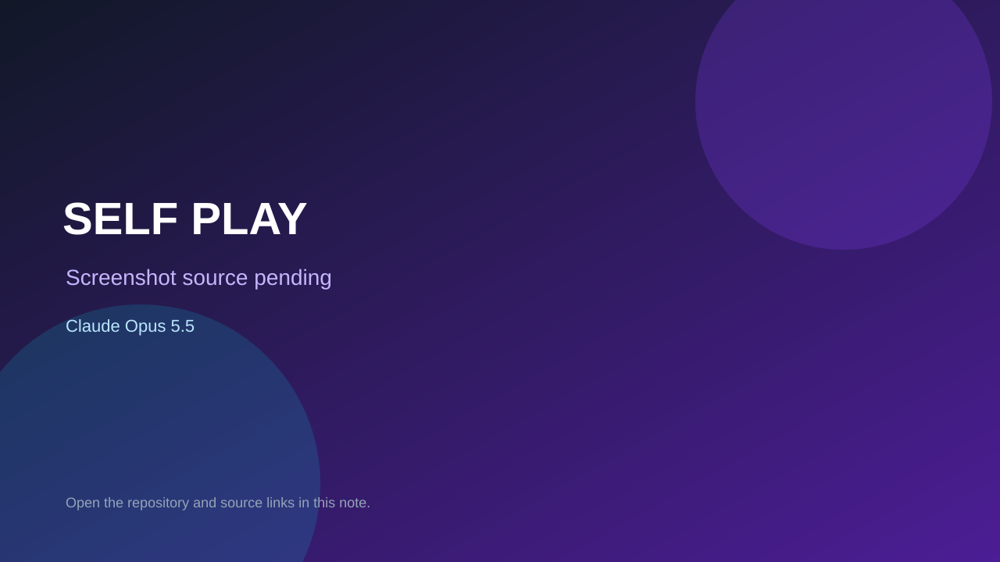

# SELF PLAY

> Top-list entry: **today** (#2), **this month** (#2).

## At a glance

- **Score:** 8.3/10
- **Model:** Claude Opus 5.5
- **Technology:** Three.js, JavaScript, WebGL, Browser
- **Estimated FP32 operations/s at 60 FPS:** 1,500,000,000 (low confidence; static estimate, not measured).
- **Rating basis:** Distinct arena combat loop, adaptive rival trained from recorded player behavior, bundled controls/audio, and a public build; no independent playtest.
- **Verified:** 2026-10-04
- **Repository:** [https://github.com/4waiz/self-play](https://github.com/4waiz/self-play)
- **Evidence:** [direct model evidence](https://github.com/4waiz/self-play/commit/bca0e6442664508f061d9c775a895abe1171eb53)
- **Live demo:** [open demo](https://4waiz.github.io/self-play/)

## Screenshots

No screenshot source is recorded yet. Keep the placeholder until a repository, awesome list, or creator source provides an image.

## Model attribution

Open the evidence link above. Evidence grade: **direct model evidence**.

## Source description

The initial game-creation commit directly co-authors Claude Opus 5.5. Source implements a browser arena shooter where a small neural net trains on the player’s actions and becomes an Echo rival; the creator’s README links a live game, which returned HTTP 200. Count the game once. No independent full playthrough was performed.

### Gameplay source

- [https://github.com/4waiz/self-play/blob/bca0e6442664508f061d9c775a895abe1171eb53/index.html](https://github.com/4waiz/self-play/blob/bca0e6442664508f061d9c775a895abe1171eb53/index.html)
- [https://github.com/4waiz/self-play/commit/bca0e6442664508f061d9c775a895abe1171eb53](https://github.com/4waiz/self-play/commit/bca0e6442664508f061d9c775a895abe1171eb53)

## Verification notes

- **Status:** verified_source
- **Counted units in repository:** 1
- **Units covered by this note:** 1
- **Discovery:** GitHub commit search: Claude Opus 5.5 game commits dated 2026-10-04 (Asia/Ho_Chi_Minh); https://github.com/4waiz/self-play; https://github.com/4waiz/self-play/commit/bca0e6442664508f061d9c775a895abe1171eb53

[Back to the awesome list](../../README.md)
