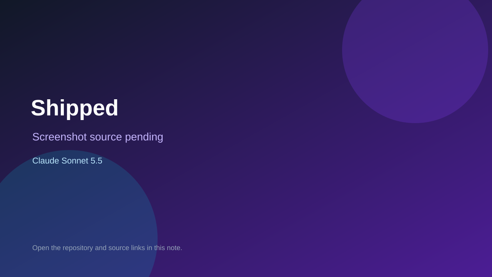

# Shipped

> Verified game note.

## At a glance

- **Score:** 7.7/10
- **Model:** Claude Sonnet 5.5
- **Technology:** TypeScript, React, Browser
- **Estimated FP32 operations/s at 60 FPS:** 150,000,000 (low confidence; static estimate, not measured).
- **Rating basis:** Sim systems with tests and tutorial runs; no playtest.
- **Verified:** 2026-10-07
- **Repository:** [https://github.com/madebynova/Shipped](https://github.com/madebynova/Shipped)
- **Evidence:** [direct model evidence](https://github.com/madebynova/Shipped/commit/3122e187d5cf866a36c25844adddec6a31d17909)

## Screenshots

No screenshot source is recorded yet. Keep the placeholder until a repository, awesome list, or creator source provides an image.

## Model attribution

Open the evidence link above. Evidence grade: **direct model evidence**.

## Source description

Game-dev sim with economy, reviews, live events and bots plus engine tests; Sonnet 5.5 trailers.

### Gameplay source

- [https://github.com/madebynova/Shipped/blob/main/index.html](https://github.com/madebynova/Shipped/blob/main/index.html)
- [https://github.com/madebynova/Shipped/commit/3122e187d5cf866a36c25844adddec6a31d17909](https://github.com/madebynova/Shipped/commit/3122e187d5cf866a36c25844adddec6a31d17909)

## Verification notes

- **Status:** verified_source
- **Counted units in repository:** 1
- **Units covered by this note:** 1
- **Discovery:** GitHub commit pool: Opus/Sonnet game commits filtered to repos created Oct 6-7 (Asia/Ho_Chi_Minh); https://github.com/madebynova/Shipped; https://github.com/madebynova/Shipped/commit/3122e187d5cf866a36c25844adddec6a31d17909

[Back to the awesome list](../../README.md)
