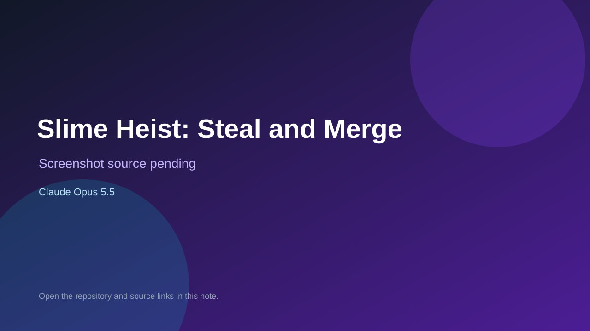

# Slime Heist: Steal and Merge

> Verified game note.

## At a glance

- **Score:** 7.7/10
- **Model:** Claude Opus 5.5
- **Technology:** Luau, Roblox, Rojo
- **Estimated FP32 operations/s at 60 FPS:** 800,000,000 (low confidence; static estimate, not measured).
- **Rating basis:** Packaged Roblox game with progression; no in-experience test.
- **Verified:** 2026-10-07
- **Repository:** [https://github.com/Matthew-Uhlar/Roblox-Test](https://github.com/Matthew-Uhlar/Roblox-Test)
- **Evidence:** [direct model evidence](https://github.com/Matthew-Uhlar/Roblox-Test/commit/5b74663b11c80d83ea7f386232ff6e5759846817)

## Screenshots

No screenshot source is recorded yet. Keep the placeholder until a repository, awesome list, or creator source provides an image.

## Model attribution

Open the evidence link above. Evidence grade: **direct model evidence**.

## Source description

Roblox slime game with map builder, progression, monetization and publishing pipeline; Opus 5.5 trailers with session links. Needs Roblox to play.

### Gameplay source

- [https://github.com/Matthew-Uhlar/Roblox-Test/blob/claude/jolly-archimedes-9usphg/default.project.json](https://github.com/Matthew-Uhlar/Roblox-Test/blob/claude/jolly-archimedes-9usphg/default.project.json)
- [https://github.com/Matthew-Uhlar/Roblox-Test/commit/5b74663b11c80d83ea7f386232ff6e5759846817](https://github.com/Matthew-Uhlar/Roblox-Test/commit/5b74663b11c80d83ea7f386232ff6e5759846817)

## Verification notes

- **Status:** verified_source
- **Counted units in repository:** 1
- **Units covered by this note:** 1
- **Discovery:** GitHub commit pool: Opus/Sonnet game commits filtered to repos created Oct 6-7 (Asia/Ho_Chi_Minh); https://github.com/Matthew-Uhlar/Roblox-Test; https://github.com/Matthew-Uhlar/Roblox-Test/commit/5b74663b11c80d83ea7f386232ff6e5759846817

[Back to the awesome list](../../README.md)
