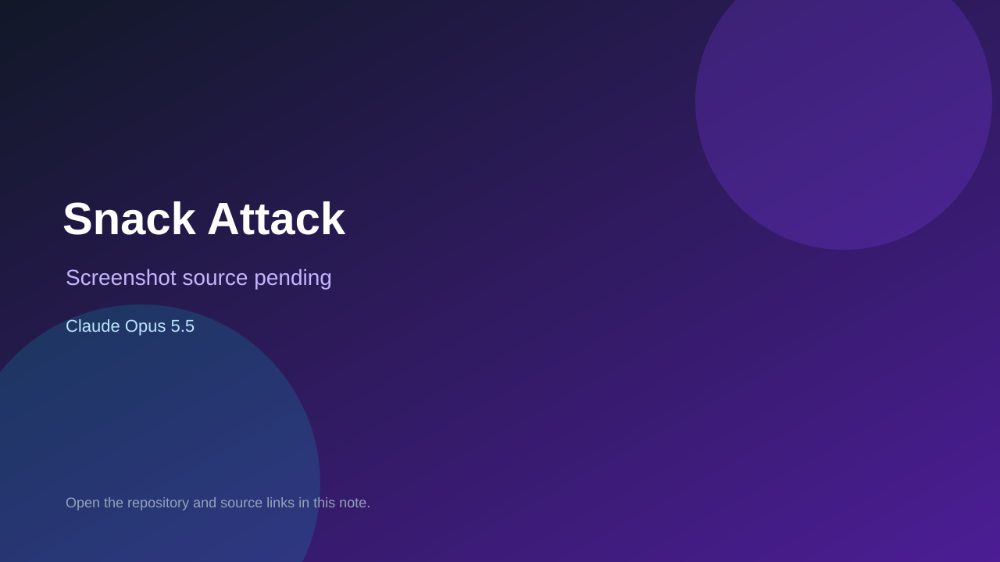

# Snack Attack

> Verified game note.

## At a glance

- **Score:** 7.8/10
- **Model:** Claude Opus 5.5
- **Technology:** Python, OpenCV
- **Estimated FP32 operations/s at 60 FPS:** 300,000,000 (low confidence; static estimate, not measured).
- **Rating basis:** Three tested motion games; camera gated, no playtest.
- **Verified:** 2026-10-07
- **Repository:** [https://github.com/mirrash7/Games](https://github.com/mirrash7/Games)
- **Evidence:** [direct model evidence](https://github.com/mirrash7/Games/commit/e6faac61241e0ea4d389a8f169e075b8f6d32043)

## Screenshots

No screenshot source is recorded yet. Keep the placeholder until a repository, awesome list, or creator source provides an image.

## Model attribution

Open the evidence link above. Evidence grade: **direct model evidence**.

## Source description

Body-controlled arcade on a pose backbone with three tested games; Opus 5.5 trailers. Needs a camera to play.

### Gameplay source

- [https://github.com/mirrash7/Games/blob/main/src/kpapp/game/fruitninja/game.py](https://github.com/mirrash7/Games/blob/main/src/kpapp/game/fruitninja/game.py)
- [https://github.com/mirrash7/Games/commit/e6faac61241e0ea4d389a8f169e075b8f6d32043](https://github.com/mirrash7/Games/commit/e6faac61241e0ea4d389a8f169e075b8f6d32043)

## Verification notes

- **Status:** verified_source
- **Counted units in repository:** 3
- **Units covered by this note:** 1
- **Discovery:** GitHub commit pool: Opus/Sonnet game commits filtered to repos created Oct 6-7 (Asia/Ho_Chi_Minh); https://github.com/mirrash7/Games; https://github.com/mirrash7/Games/commit/e6faac61241e0ea4d389a8f169e075b8f6d32043

[Back to the awesome list](../../README.md)
