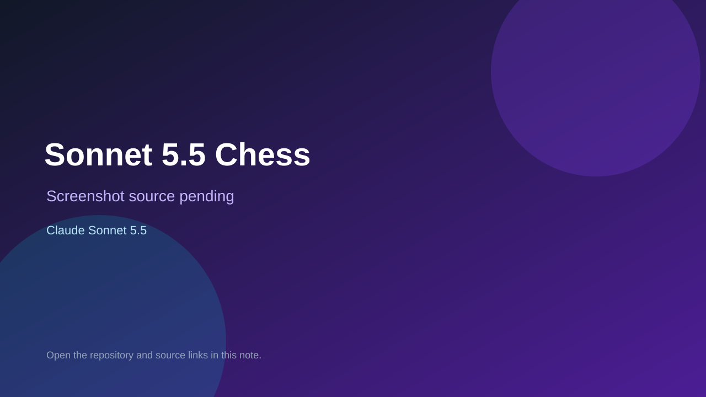

# Sonnet 5.5 Chess

> Verified game note.

## At a glance

- **Score:** 7.2/10
- **Model:** Claude Sonnet 5.5
- **Technology:** C++, UCI, Native
- **Estimated FP32 operations/s at 60 FPS:** 100,000,000 (low confidence; static estimate, not measured).
- **Rating basis:** Rated engine with sources and binary; engine only, no UI playtest.
- **Verified:** 2026-10-07
- **Repository:** [https://github.com/stevemaughan/sonnet-5.5-chess-24hrs](https://github.com/stevemaughan/sonnet-5.5-chess-24hrs)
- **Evidence:** [creator-reported model evidence](https://github.com/stevemaughan/sonnet-5.5-chess-24hrs/commit/fa7a0cdc9d966a70ea758494c87163ee24b3e0e8)

## Screenshots

No screenshot source is recorded yet. Keep the placeholder until a repository, awesome list, or creator source provides an image.

## Model attribution

Open the evidence link above. Evidence grade: **creator-reported model evidence**.

## Source description

UCI chess engine written in a 24 hour Sonnet 5.5 run with a 3420 rating, sources, networks and log. The run commit subject and README credit Sonnet 5.5 while the trailer names Opus 5.5. Engine only: needs a UCI host, no bundled UI.

### Gameplay source

- [https://github.com/stevemaughan/sonnet-5.5-chess-24hrs/blob/main/README.md](https://github.com/stevemaughan/sonnet-5.5-chess-24hrs/blob/main/README.md)
- [https://github.com/stevemaughan/sonnet-5.5-chess-24hrs/commit/fa7a0cdc9d966a70ea758494c87163ee24b3e0e8](https://github.com/stevemaughan/sonnet-5.5-chess-24hrs/commit/fa7a0cdc9d966a70ea758494c87163ee24b3e0e8)

## Verification notes

- **Status:** verified_source
- **Counted units in repository:** 1
- **Units covered by this note:** 1
- **Discovery:** GitHub repository search: Claude Sonnet 5.5 created 2026-10-06..2026-10-07; https://github.com/stevemaughan/sonnet-5.5-chess-24hrs; https://github.com/stevemaughan/sonnet-5.5-chess-24hrs/commit/fa7a0cdc9d966a70ea758494c87163ee24b3e0e8

[Back to the awesome list](../../README.md)
